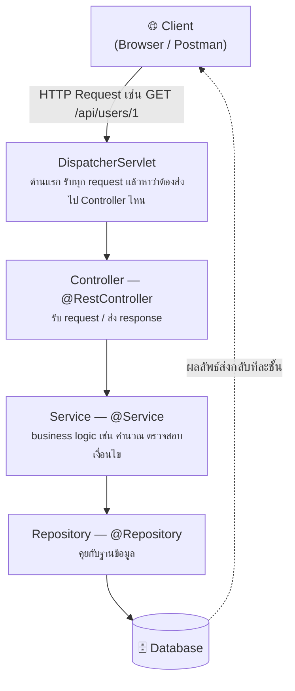
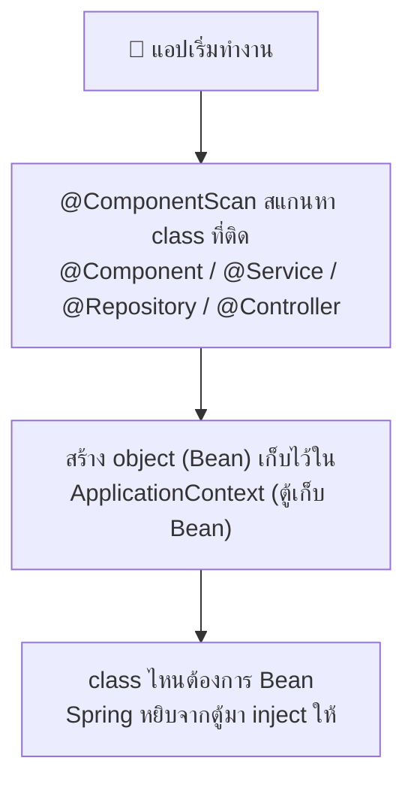
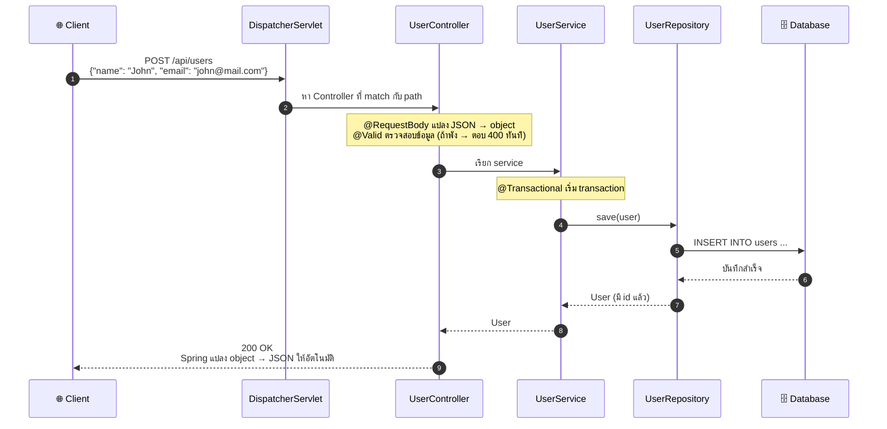
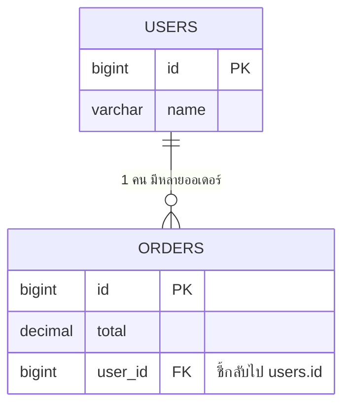
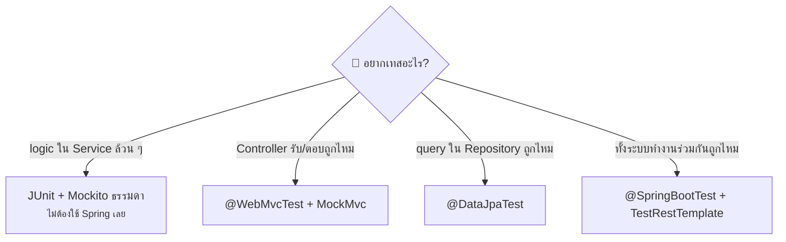
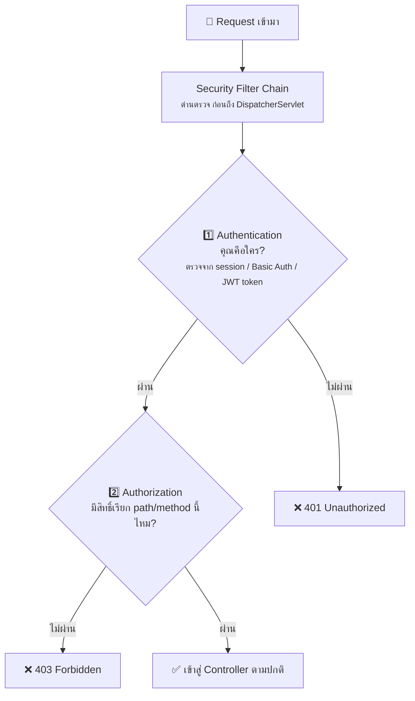

# 📘 Spring Boot สรุปสำหรับผู้เริ่มต้น

> อัปเดตล่าสุด: กรกฎาคม 2026 | เวอร์ชันล่าสุด: **Spring Boot 4.1.0**

---

## 1. Spring Boot คืออะไร?

Spring Boot คือ framework สำหรับสร้างแอปพลิเคชัน Java (เช่น REST API, Web App)
ที่ **ตั้งค่าให้เกือบทุกอย่างอัตโนมัติ** — ไม่ต้องเขียน config XML เยอะ ๆ เหมือน Spring แบบเก่า

จุดเด่น:

- ✅ **Auto-configuration** — ตั้งค่าให้เองตาม dependency ที่เราใส่
- ✅ **Embedded Server** — มี Tomcat ในตัว รันได้เลยด้วย `java -jar`
- ✅ **Starter Dependencies** — ใส่ dependency เดียว ได้ของครบชุด เช่น `spring-boot-starter-web`

---

## 2. เวอร์ชันปัจจุบัน (ก.ค. 2026)

| สาย | Patch ล่าสุด | Java ขั้นต่ำ | ซัพพอร์ตถึง | เหมาะกับ |
|---|---|---|---|---|
| **4.1** | 4.1.0 | Java 17 | ก.ค. 2027 | โปรเจกต์ใหม่ อยากได้ฟีเจอร์ล่าสุด |
| **4.0** | 4.0.7 | Java 17 | ธ.ค. 2026 | — |
| **3.5 (LTS)** | 3.5.16 | Java 17 | มิ.ย. 2032 | โปรเจกต์ที่ต้องการความเสถียรยาว ๆ |

**ฟีเจอร์เด่นของ 4.x:**
- รองรับ **gRPC** ในตัว (4.1)
- **HTTP Service Clients** — ประกาศ interface แล้ว Spring ยิง REST ให้เอง (4.0)
- **API Versioning** ในตัว (4.0)
- **OpenTelemetry starter** สำหรับ metrics/tracing (4.0)
- ป้องกัน **SSRF** ด้วย `InetAddressFilter` (4.1)

---

## 3. Flow การทำงานของ Spring Boot (ภาพรวม)

เมื่อมี HTTP Request เข้ามา จะวิ่งผ่านชั้นต่าง ๆ แบบนี้:



> 💡 จำง่าย ๆ: **Controller = ประตูหน้าบ้าน, Service = สมอง, Repository = คนคุยกับ DB**

---

## 4. Annotation ที่ต้องรู้ (เรียงตามการใช้งานจริง)

### 4.1 จุดเริ่มต้นของแอป

| Annotation | ความหมาย |
|---|---|
| `@SpringBootApplication` | ติดที่ class main — บอกว่า "นี่คือแอป Spring Boot" (รวม 3 ตัวล่างไว้ในตัวเดียว) |
| `@Configuration` | class นี้เป็นที่ประกาศ Bean |
| `@EnableAutoConfiguration` | ให้ Spring ตั้งค่าอัตโนมัติตาม dependency |
| `@ComponentScan` | สแกนหา class ที่ติด annotation ใน package นี้และ package ย่อย |

```java
@SpringBootApplication
public class DemoApplication {
    public static void main(String[] args) {
        SpringApplication.run(DemoApplication.class, args);
    }
}
```

---

### 4.2 สร้าง REST API (Controller Layer)

| Annotation | ความหมาย |
|---|---|
| `@RestController` | class นี้รับ HTTP request และตอบเป็น JSON |
| `@RequestMapping("/api")` | กำหนด path หลักของ class |
| `@GetMapping` | รับ request แบบ GET (ดึงข้อมูล) |
| `@PostMapping` | รับ request แบบ POST (สร้างข้อมูล) |
| `@PutMapping` | รับ request แบบ PUT (แก้ไขทั้งก้อน) |
| `@DeleteMapping` | รับ request แบบ DELETE (ลบข้อมูล) |
| `@PathVariable` | ดึงค่าจาก URL เช่น `/users/{id}` → id |
| `@RequestParam` | ดึงค่าจาก query string เช่น `?name=john` |
| `@RequestBody` | แปลง JSON ที่ส่งมา → Java Object |

```java
@RestController
@RequestMapping("/api/users")
public class UserController {

    // GET /api/users/1
    @GetMapping("/{id}")
    public User getUser(@PathVariable Long id) {
        return userService.findById(id);
    }

    // GET /api/users?name=john
    @GetMapping
    public List<User> search(@RequestParam String name) {
        return userService.findByName(name);
    }

    // POST /api/users  (body เป็น JSON)
    @PostMapping
    public User create(@RequestBody User user) {
        return userService.save(user);
    }
}
```

---

### 4.3 Business Logic และ Database (Service / Repository Layer)

| Annotation | ความหมาย |
|---|---|
| `@Service` | class นี้เป็น business logic |
| `@Repository` | class นี้คุยกับฐานข้อมูล |
| `@Component` | ตัวพ่อของ `@Service`/`@Repository` — ให้ Spring จัดการ class นี้เป็น Bean |
| `@Transactional` | ถ้า method นี้พัง ให้ rollback database ทั้งหมด |

```java
@Service
public class UserService {

    private final UserRepository userRepository;

    // Constructor Injection — Spring จะส่ง UserRepository เข้ามาให้เอง
    public UserService(UserRepository userRepository) {
        this.userRepository = userRepository;
    }

    @Transactional
    public User save(User user) {
        return userRepository.save(user);
    }
}
```

```java
// แค่ประกาศ interface — Spring Data JPA สร้าง query ให้เองจากชื่อ method!
public interface UserRepository extends JpaRepository<User, Long> {
    List<User> findByName(String name);  // → SELECT * FROM users WHERE name = ?
}
```

---

### 4.4 Dependency Injection (DI) — หัวใจของ Spring

**DI คือ:** เราไม่ต้อง `new` object เอง — Spring สร้างและส่งมาให้

| Annotation | ความหมาย |
|---|---|
| `@Autowired` | ขอให้ Spring inject Bean เข้ามา (ถ้าใช้ constructor เดียว ไม่ต้องใส่ก็ได้) |
| `@Bean` | ประกาศ Bean เองใน `@Configuration` class |
| `@Qualifier("ชื่อ")` | เลือก Bean เจาะจงตัว เมื่อมีหลายตัวชนิดเดียวกัน |
| `@Primary` | ถ้ามี Bean ซ้ำชนิดกัน ให้ใช้ตัวนี้เป็นหลัก |
| `@Value("${key}")` | ดึงค่าจาก `application.properties` |

```java
// ❌ แบบเก่า — ผูกติดกันแน่น เทสยาก
UserService service = new UserService(new UserRepository());

// ✅ แบบ Spring — แค่ประกาศใน constructor แล้ว Spring จัดให้
@Service
public class UserService {
    private final UserRepository repo;
    public UserService(UserRepository repo) {  // Spring inject ให้อัตโนมัติ
        this.repo = repo;
    }
}
```

**Flow ของ DI:**



---

### 4.5 Entity — Map class กับตารางฐานข้อมูล (JPA)

| Annotation | ความหมาย |
|---|---|
| `@Entity` | class นี้คือตารางใน database |
| `@Table(name = "users")` | ระบุชื่อตาราง (ถ้าไม่ใส่ ใช้ชื่อ class) |
| `@Id` | field นี้คือ primary key |
| `@GeneratedValue` | ให้ database gen ค่า id ให้เอง |
| `@Column` | ตั้งค่า column เช่น ชื่อ, ห้ามเป็น null |

```java
@Entity
@Table(name = "users")
public class User {

    @Id
    @GeneratedValue(strategy = GenerationType.IDENTITY)
    private Long id;

    @Column(nullable = false, length = 100)
    private String name;

    private String email;
}
```

---

### 4.6 Validation — ตรวจสอบข้อมูลก่อนเข้าระบบ

| Annotation | ความหมาย |
|---|---|
| `@Valid` | สั่งให้ตรวจสอบ object ตาม rule ที่ประกาศไว้ |
| `@NotNull` | ห้ามเป็น null |
| `@NotBlank` | ห้ามเป็นค่าว่าง (สำหรับ String) |
| `@Email` | ต้องเป็นรูปแบบอีเมล |
| `@Size(min=2, max=50)` | จำกัดความยาว |
| `@Min` / `@Max` | จำกัดค่าตัวเลข |

```java
public class CreateUserRequest {
    @NotBlank(message = "กรุณากรอกชื่อ")
    private String name;

    @Email(message = "รูปแบบอีเมลไม่ถูกต้อง")
    private String email;
}

// ใน Controller — ใส่ @Valid เพื่อให้ rule ทำงาน
@PostMapping
public User create(@Valid @RequestBody CreateUserRequest request) { ... }
```

---

### 4.7 จัดการ Error (Exception Handling)

| Annotation | ความหมาย |
|---|---|
| `@RestControllerAdvice` | class กลางสำหรับดักจับ error ของทุก Controller |
| `@ExceptionHandler` | ระบุว่า method นี้จัดการ exception ชนิดไหน |

```java
@RestControllerAdvice
public class GlobalExceptionHandler {

    @ExceptionHandler(UserNotFoundException.class)
    public ResponseEntity<String> handleNotFound(UserNotFoundException ex) {
        return ResponseEntity.status(HttpStatus.NOT_FOUND).body(ex.getMessage());
    }
}
```

---

### 4.8 ตั้งค่าตาม Environment

| Annotation | ความหมาย |
|---|---|
| `@Profile("dev")` | Bean นี้ทำงานเฉพาะตอนรัน profile dev |
| `@ConfigurationProperties(prefix = "app")` | Map ค่าจาก properties ทั้งชุดเข้า class |

```properties
# application.properties
app.name=MyApp
app.max-users=100
```

```java
@ConfigurationProperties(prefix = "app")
public record AppProperties(String name, int maxUsers) {}
```

---

## 5. Flow สรุป: จาก Request → Response ครบวงจร

ตัวอย่าง: ผู้ใช้ยิง `POST /api/users` พร้อม JSON



---

## 6. เริ่มโปรเจกต์แรกยังไง?

1. ไปที่ **[start.spring.io](https://start.spring.io)** (Spring Initializr)
2. เลือก:
   - Project: **Maven** หรือ Gradle
   - Language: **Java**
   - Spring Boot: **4.1.0** (หรือ 3.5.x ถ้าอยากได้ LTS)
   - Java: **17** ขึ้นไป (แนะนำ 21)
3. เพิ่ม Dependencies พื้นฐาน:
   - `Spring Web` — สร้าง REST API
   - `Spring Data JPA` — คุยกับ database
   - `H2 Database` — database ในหน่วยความจำ ไว้ฝึก
   - `Validation` — ตรวจสอบข้อมูล
4. กด **Generate** → แตก zip → เปิดใน IDE → รัน!

```bash
./mvnw spring-boot:run
# แอปจะรันที่ http://localhost:8080
```

---

## 7. สรุป Annotation แบบ Cheat Sheet

```
เริ่มแอป          → @SpringBootApplication
รับ Request       → @RestController, @GetMapping, @PostMapping
ดึงข้อมูลจาก URL   → @PathVariable, @RequestParam, @RequestBody
Business Logic    → @Service
คุย Database      → @Repository, @Entity, @Id
Inject Bean       → constructor injection (หรือ @Autowired)
ตรวจสอบข้อมูล     → @Valid, @NotBlank, @Email
จัดการ Error      → @RestControllerAdvice, @ExceptionHandler
อ่าน Config       → @Value, @ConfigurationProperties
ความสัมพันธ์ตาราง  → @OneToMany, @ManyToOne, @JoinColumn
เขียน Test        → @Test, @BeforeEach, @Mock/@InjectMocks (JUnit/Mockito)
                    @SpringBootTest, @WebMvcTest, @DataJpaTest, @MockitoBean (Spring)
                    @ActiveProfiles, @WithMockUser (สภาพแวดล้อม/Security)
Security          → @EnableWebSecurity, @PreAuthorize
```

---

## 8. JPA Relationships — เชื่อมความสัมพันธ์ระหว่างตาราง

ในฐานข้อมูลจริง ตารางมักเชื่อมกัน เช่น ผู้ใช้ 1 คน มีได้หลายออเดอร์
JPA ใช้ annotation บอกความสัมพันธ์เหล่านี้:

| Annotation | ความสัมพันธ์ | ตัวอย่าง |
|---|---|---|
| `@OneToOne` | 1 ต่อ 1 | User ↔ Profile (คนละ 1 โปรไฟล์) |
| `@OneToMany` | 1 ต่อ หลาย | User → Orders (1 คนมีหลายออเดอร์) |
| `@ManyToOne` | หลาย ต่อ 1 | Orders → User (หลายออเดอร์เป็นของคนเดียว) |
| `@ManyToMany` | หลาย ต่อ หลาย | Student ↔ Course (นักเรียนลงหลายวิชา วิชามีหลายคน) |
| `@JoinColumn` | ระบุชื่อ column ที่เป็น foreign key | `user_id` |

### ตัวอย่าง: User มีหลาย Order

```java
@Entity
public class User {
    @Id
    @GeneratedValue(strategy = GenerationType.IDENTITY)
    private Long id;

    private String name;

    // 1 User มีหลาย Order
    // mappedBy = "user" หมายถึง field ชื่อ user ใน class Order เป็นเจ้าของความสัมพันธ์
    @OneToMany(mappedBy = "user", cascade = CascadeType.ALL)
    private List<Order> orders = new ArrayList<>();
}
```

```java
@Entity
@Table(name = "orders")
public class Order {
    @Id
    @GeneratedValue(strategy = GenerationType.IDENTITY)
    private Long id;

    private BigDecimal total;

    // หลาย Order เป็นของ User คนเดียว
    // ฝั่งนี้คือ "เจ้าของ" — ตาราง orders จะมี column user_id เก็บ foreign key
    @ManyToOne(fetch = FetchType.LAZY)
    @JoinColumn(name = "user_id")
    private User user;
}
```

**โครงสร้างตารางที่ได้:**



### 2 คำที่ต้องรู้

- **`fetch = FetchType.LAZY`** — ยังไม่โหลดข้อมูลฝั่งตรงข้ามจนกว่าจะเรียกใช้จริง (แนะนำให้ใช้เสมอ ป้องกัน query เกินจำเป็น)
- **`cascade = CascadeType.ALL`** — ทำอะไรกับ User ให้ทำกับ orders ของเขาด้วย เช่น ลบ User → ลบ orders ตาม

> ⚠️ ข้อควรระวังยอดฮิต: ถ้าแปลง Entity ที่มีความสัมพันธ์เป็น JSON ตรง ๆ อาจเกิด **loop ไม่รู้จบ** (User → Order → User → ...) ทางแก้ที่ดีคือสร้าง **DTO** (class แยกสำหรับตอบ response) แทนการส่ง Entity ออกไปตรง ๆ

---

## 9. การเขียน Test

Spring Boot มีเครื่องมือเทสมาให้ครบ (อยู่ใน `spring-boot-starter-test` ซึ่งติดมากับทุกโปรเจกต์)

| Annotation | ใช้เทสอะไร | ความเร็ว |
|---|---|---|
| `@SpringBootTest` | ทั้งแอป (โหลด Bean ทุกตัว) | ช้า |
| `@WebMvcTest(XxxController.class)` | เฉพาะ Controller ชั้นเดียว | เร็ว |
| `@DataJpaTest` | เฉพาะ Repository + database | เร็ว |
| `@MockitoBean` | แทนที่ Bean จริงด้วยตัวปลอม (mock) | — |

> 💡 หลักการเลือก: **เทสให้แคบที่สุดเท่าที่ทำได้** — เทส Controller ใช้ `@WebMvcTest`, เทส Repository ใช้ `@DataJpaTest`, ใช้ `@SpringBootTest` เฉพาะตอนอยากเทสภาพรวมจริง ๆ

### 9.1 เทส Controller ด้วย @WebMvcTest

โหลดแค่ Controller ตัวเดียว ส่วน Service ใช้ตัวปลอม (mock) แทน:

```java
@WebMvcTest(UserController.class)
class UserControllerTest {

    @Autowired
    private MockMvc mockMvc;          // ตัวจำลองการยิง HTTP request

    @MockitoBean
    private UserService userService;  // Service ปลอม — กำหนดพฤติกรรมเองได้

    @Test
    void getUser_returnsUser() throws Exception {
        // กำหนดว่าถ้า service ถูกเรียก ให้ตอบอะไร
        given(userService.findById(1L)).willReturn(new User(1L, "John"));

        // ยิง GET /api/users/1 แล้วตรวจคำตอบ
        mockMvc.perform(get("/api/users/1"))
               .andExpect(status().isOk())
               .andExpect(jsonPath("$.name").value("John"));
    }
}
```

### 9.2 เทส Repository ด้วย @DataJpaTest

โหลดเฉพาะชั้น JPA และใช้ database ในหน่วยความจำ (H2) อัตโนมัติ:

```java
@DataJpaTest
class UserRepositoryTest {

    @Autowired
    private UserRepository userRepository;

    @Test
    void findByName_returnsMatchingUser() {
        userRepository.save(new User("John", "john@mail.com"));

        List<User> result = userRepository.findByName("John");

        assertThat(result).hasSize(1);
        assertThat(result.get(0).getEmail()).isEqualTo("john@mail.com");
    }
}
```

### 9.3 เทสทั้งแอปด้วย @SpringBootTest

```java
@SpringBootTest(webEnvironment = SpringBootTest.WebEnvironment.RANDOM_PORT)
class UserApiIntegrationTest {

    @Autowired
    private TestRestTemplate restTemplate;  // client สำหรับยิง API จริง

    @Test
    void createUser_thenFetchIt() {
        var request = new CreateUserRequest("John", "john@mail.com");

        var created = restTemplate.postForEntity("/api/users", request, User.class);
        assertThat(created.getStatusCode()).isEqualTo(HttpStatus.OK);

        var fetched = restTemplate.getForEntity("/api/users/" + created.getBody().getId(), User.class);
        assertThat(fetched.getBody().getName()).isEqualTo("John");
    }
}
```

**Flow การเลือกชนิดเทส:**



### 9.4 Annotation ฝั่งเทสทั้งหมด (ไม่ได้มีแค่ @MockitoBean!)

annotation ที่ใช้ในไฟล์เทสมาจาก 3 ที่: **JUnit 5** (ควบคุมการรันเทส), **Mockito** (สร้างตัวปลอม), และ **Spring** (ปรับสภาพแวดล้อมเทส)

#### กลุ่มที่ 1: JUnit 5 — ควบคุมการรันเทส

| Annotation | ความหมาย |
|---|---|
| `@Test` | method นี้คือเทส 1 เคส |
| `@BeforeEach` / `@AfterEach` | รันก่อน/หลังเทส **ทุกเคส** (เตรียม/เคลียร์ข้อมูล) |
| `@BeforeAll` / `@AfterAll` | รันครั้งเดียวก่อน/หลังเทส **ทั้ง class** |
| `@DisplayName("...")` | ตั้งชื่อเทสให้อ่านง่าย |
| `@Disabled` | ข้ามเทสนี้ชั่วคราว |
| `@ParameterizedTest` + `@ValueSource` | รันเทสเดิมซ้ำด้วยข้อมูลหลายชุด |

```java
class CalculatorTest {

    @BeforeEach
    void setUp() { ... }  // รันก่อนทุก @Test

    @Test
    @DisplayName("บวกเลขสองตัวได้ผลถูกต้อง")
    void addsTwoNumbers() { ... }

    @ParameterizedTest
    @ValueSource(ints = {1, 5, 100})   // รัน 3 รอบด้วยค่า 1, 5, 100
    void acceptsPositiveNumbers(int value) { ... }
}
```

#### กลุ่มที่ 2: Mockito ล้วน ๆ — เทส Service โดยไม่โหลด Spring (เร็วสุด)

| Annotation | ความหมาย |
|---|---|
| `@ExtendWith(MockitoExtension.class)` | เปิดใช้ Mockito กับ JUnit 5 |
| `@Mock` | สร้าง object ปลอม |
| `@InjectMocks` | สร้าง object จริงที่จะเทส แล้วยัด mock เข้าไปให้ |

```java
@ExtendWith(MockitoExtension.class)   // ไม่มี Spring context เลย — รันเร็วมาก
class UserServiceTest {

    @Mock
    UserRepository userRepository;     // ตัวปลอม

    @InjectMocks
    UserService userService;           // ตัวจริงที่เทส (Mockito ยัด mock ให้)

    @Test
    void findById_returnsUser() {
        given(userRepository.findById(1L)).willReturn(Optional.of(new User(1L, "John")));

        User result = userService.findById(1L);

        assertThat(result.getName()).isEqualTo("John");
    }
}
```

> 💡 **`@Mock` vs `@MockitoBean` ต่างกันยังไง?**
> - `@Mock` — ใช้ตอน**ไม่มี** Spring context (เทสแบบกลุ่มนี้)
> - `@MockitoBean` — ใช้ตอน**มี** Spring context (เช่นใน `@WebMvcTest`) — มันเข้าไป**แทนที่ Bean จริง**ในตู้ ApplicationContext

#### กลุ่มที่ 3: Spring — ปรับสภาพแวดล้อมเทส

| Annotation | ความหมาย |
|---|---|
| `@MockitoBean` | แทนที่ Bean จริงใน context ด้วยตัวปลอม |
| `@MockitoSpyBean` | ใช้ Bean จริง แต่ override เฉพาะบาง method ได้ |
| `@ActiveProfiles("test")` | รันเทสด้วย profile test (ใช้ `application-test.properties`) |
| `@TestPropertySource` | override ค่า config เฉพาะเทสนี้ |
| `@Sql("/seed-data.sql")` | รันสคริปต์ SQL เตรียมข้อมูลก่อนเทส |
| `@Transactional` (บนเทส) | ทุกเคส rollback อัตโนมัติหลังจบ — ข้อมูลไม่ค้างใน DB |
| `@AutoConfigureMockMvc` | ใช้ MockMvc ร่วมกับ `@SpringBootTest` ได้ |
| `@TestConfiguration` | ประกาศ Bean เฉพาะสำหรับเทส |
| `@DirtiesContext` | สร้าง context ใหม่หลังเทสนี้ (ใช้เมื่อเทสไปแก้ state ของ Bean) |

#### กลุ่มที่ 4: เทสเฉพาะทาง

| Annotation | ความหมาย |
|---|---|
| `@JsonTest` | เทสการแปลง JSON อย่างเดียว |
| `@RestClientTest` | เทส class ที่ยิง API ออกไปข้างนอก (มี mock server ให้) |
| `@WithMockUser(roles = "ADMIN")` | จำลอง user ที่ login แล้ว — ใช้เทสร่วมกับ Spring Security |
| `@Testcontainers` + `@ServiceConnection` | รัน database จริง (PostgreSQL, Redis) ใน Docker ตอนเทส |

```java
// ตัวอย่าง: เทส endpoint ที่ล็อกไว้เฉพาะ ADMIN
@WebMvcTest(AdminController.class)
class AdminControllerTest {

    @Autowired MockMvc mockMvc;

    @Test
    @WithMockUser(roles = "ADMIN")   // จำลองว่า login เป็น ADMIN แล้ว
    void adminCanAccess() throws Exception {
        mockMvc.perform(get("/api/admin/stats"))
               .andExpect(status().isOk());
    }

    @Test
    @WithMockUser(roles = "USER")    // USER ธรรมดาต้องโดน 403
    void userIsForbidden() throws Exception {
        mockMvc.perform(get("/api/admin/stats"))
               .andExpect(status().isForbidden());
    }
}
```

> 📌 หมายเหตุ: `@Autowired` ในไฟล์เทสไม่ใช่ annotation พิเศษของการเทส — มันคือการขอ Bean จาก Spring ตามปกติ แค่ในเทสต้องใช้กับ field เพราะ JUnit เป็นคนสร้าง class เทสเอง ไม่ได้สร้างผ่าน constructor ของ Spring

**ชุดที่ใช้บ่อยจริงในงาน:** `@Test`, `@BeforeEach`, `@Mock`/`@InjectMocks` (เทส Service), `@MockitoBean` + MockMvc (เทส Controller), `@ActiveProfiles("test")` และ `@WithMockUser` เมื่อมี Security

---

## 10. Spring Security เบื้องต้น — ใส่ระบบล็อกอิน/สิทธิ์

เพิ่ม dependency แล้วทุก endpoint จะถูกล็อกทันที (ต้อง login ก่อนถึงเรียกได้):

```xml
<dependency>
    <groupId>org.springframework.boot</groupId>
    <artifactId>spring-boot-starter-security</artifactId>
</dependency>
```

### 2 คำศัพท์หลัก

- **Authentication (ยืนยันตัวตน)** — "คุณคือใคร?" → ตรวจ username/password หรือ token
- **Authorization (ตรวจสิทธิ์)** — "คุณทำสิ่งนี้ได้ไหม?" → ตรวจ role เช่น ADMIN, USER

### Annotation ที่ใช้บ่อย

| Annotation | ความหมาย |
|---|---|
| `@EnableWebSecurity` | เปิดใช้และปรับแต่ง Spring Security |
| `@EnableMethodSecurity` | เปิดให้ใช้ `@PreAuthorize` บน method ได้ |
| `@PreAuthorize("hasRole('ADMIN')")` | method นี้เรียกได้เฉพาะ ADMIN |
| `@AuthenticationPrincipal` | ดึงข้อมูล user ที่ login อยู่มาใช้ใน Controller |

### ตัวอย่างการตั้งค่า

```java
@Configuration
@EnableWebSecurity
@EnableMethodSecurity
public class SecurityConfig {

    @Bean
    public SecurityFilterChain filterChain(HttpSecurity http) throws Exception {
        http
            .authorizeHttpRequests(auth -> auth
                .requestMatchers("/api/public/**").permitAll()      // เปิดให้ทุกคน
                .requestMatchers("/api/admin/**").hasRole("ADMIN")  // เฉพาะ ADMIN
                .anyRequest().authenticated()                       // ที่เหลือต้อง login
            )
            .httpBasic(Customizer.withDefaults());  // ใช้ Basic Auth (สำหรับฝึก)
        return http.build();
    }

    @Bean
    public PasswordEncoder passwordEncoder() {
        return new BCryptPasswordEncoder();  // เข้ารหัส password ก่อนเก็บ (ห้ามเก็บ plain text!)
    }
}
```

### ล็อกสิทธิ์ระดับ method

```java
@Service
public class UserService {

    @PreAuthorize("hasRole('ADMIN')")   // เฉพาะ ADMIN เท่านั้น
    public void deleteUser(Long id) { ... }

    @PreAuthorize("#username == authentication.name")  // ทำได้เฉพาะข้อมูลตัวเอง
    public User updateProfile(String username, ProfileRequest req) { ... }
}
```

### Flow การทำงานของ Spring Security



> 💡 จำง่าย ๆ: **401 = ยังไม่ได้ login, 403 = login แล้วแต่ไม่มีสิทธิ์**

ในงานจริง REST API มักใช้ **JWT (JSON Web Token)**: login ครั้งเดียวได้ token
แล้วแนบ token ใน header `Authorization: Bearer <token>` ทุก request — เป็นหัวข้อถัดไปที่ควรศึกษาต่อ

---

## 📚 แหล่งอ้างอิง

- [Spring Boot Official Docs](https://docs.spring.io/spring-boot/index.html)
- [Spring Boot 4.1 Release Notes](https://github.com/spring-projects/spring-boot/wiki/Spring-Boot-4.1-Release-Notes)
- [Spring Initializr — สร้างโปรเจกต์](https://start.spring.io)
- [Baeldung — บทความสอน Spring ที่ดีที่สุด](https://www.baeldung.com/spring-boot)
- [Spring Security Docs](https://docs.spring.io/spring-security/reference/index.html)
- [Spring Boot Testing Docs](https://docs.spring.io/spring-boot/reference/testing/index.html)
