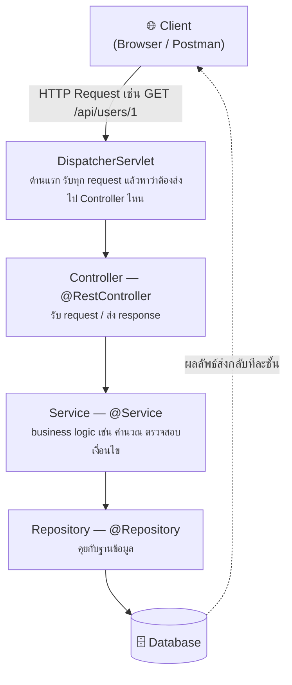
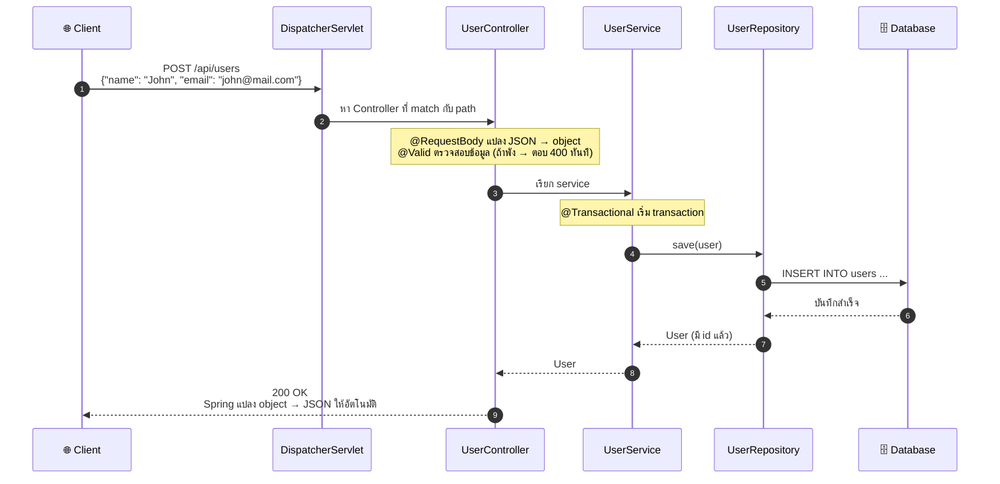

# บทที่ 2: Flow การทำงานของ Spring Boot

## Flow การทำงานของ Spring Boot (ภาพรวม)

เมื่อมี HTTP Request เข้ามา จะวิ่งผ่านชั้นต่าง ๆ แบบนี้:

> 💡 จำง่าย ๆ: **Controller = ประตูหน้าบ้าน, Service = สมอง, Repository = คนคุยกับ DB**

## Flow สรุป: จาก Request → Response ครบวงจร

ตัวอย่าง: ผู้ใช้ยิง `POST /api/users` พร้อม JSON

---

⬅️ [บทที่ 1: รู้จัก Spring Boot](01-what-is-spring-boot.md) | [🏠 สารบัญ](../README.md) | [บทที่ 3: Annotation พื้นฐาน](03-annotations.md) ➡️
