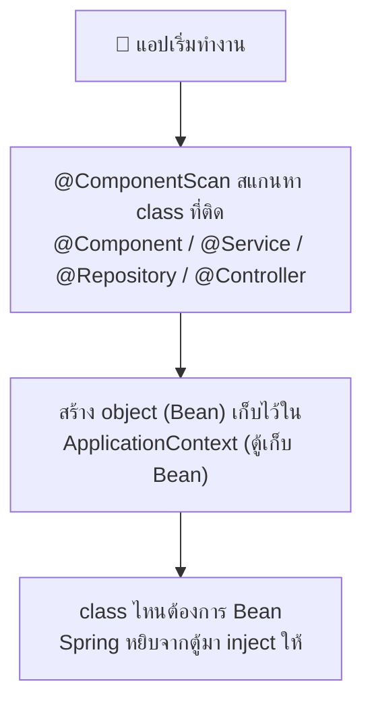

# บทที่ 3: Annotation พื้นฐานที่ต้องรู้


## 1. จุดเริ่มต้นของแอป

| Annotation | ความหมาย |
|---|---|
| `@SpringBootApplication` | ติดที่ class main — บอกว่า "นี่คือแอป Spring Boot" (รวม 3 ตัวล่างไว้ในตัวเดียว) |
| `@Configuration` | class นี้เป็นที่ประกาศ Bean |
| `@EnableAutoConfiguration` | ให้ Spring ตั้งค่าอัตโนมัติตาม dependency |
| `@ComponentScan` | สแกนหา class ที่ติด annotation ใน package นี้และ package ย่อย |

```java
@SpringBootApplication
public class DemoApplication {
    public static void main(String[] args) {
        SpringApplication.run(DemoApplication.class, args);
    }
}
```

---

## 2. สร้าง REST API (Controller Layer)

| Annotation | ความหมาย |
|---|---|
| `@RestController` | class นี้รับ HTTP request และตอบเป็น JSON |
| `@RequestMapping("/api")` | กำหนด path หลักของ class |
| `@GetMapping` | รับ request แบบ GET (ดึงข้อมูล) |
| `@PostMapping` | รับ request แบบ POST (สร้างข้อมูล) |
| `@PutMapping` | รับ request แบบ PUT (แก้ไขทั้งก้อน) |
| `@DeleteMapping` | รับ request แบบ DELETE (ลบข้อมูล) |
| `@PathVariable` | ดึงค่าจาก URL เช่น `/users/{id}` → id |
| `@RequestParam` | ดึงค่าจาก query string เช่น `?name=john` |
| `@RequestBody` | แปลง JSON ที่ส่งมา → Java Object |

```java
@RestController
@RequestMapping("/api/users")
public class UserController {

    // GET /api/users/1
    @GetMapping("/{id}")
    public User getUser(@PathVariable Long id) {
        return userService.findById(id);
    }

    // GET /api/users?name=john
    @GetMapping
    public List<User> search(@RequestParam String name) {
        return userService.findByName(name);
    }

    // POST /api/users  (body เป็น JSON)
    @PostMapping
    public User create(@RequestBody User user) {
        return userService.save(user);
    }
}
```

---

## 3. Business Logic และ Database (Service / Repository Layer)

| Annotation | ความหมาย |
|---|---|
| `@Service` | class นี้เป็น business logic |
| `@Repository` | class นี้คุยกับฐานข้อมูล |
| `@Component` | ตัวพ่อของ `@Service`/`@Repository` — ให้ Spring จัดการ class นี้เป็น Bean |
| `@Transactional` | ถ้า method นี้พัง ให้ rollback database ทั้งหมด |

```java
@Service
public class UserService {

    private final UserRepository userRepository;

    // Constructor Injection — Spring จะส่ง UserRepository เข้ามาให้เอง
    public UserService(UserRepository userRepository) {
        this.userRepository = userRepository;
    }

    @Transactional
    public User save(User user) {
        return userRepository.save(user);
    }
}
```

```java
// แค่ประกาศ interface — Spring Data JPA สร้าง query ให้เองจากชื่อ method!
public interface UserRepository extends JpaRepository<User, Long> {
    List<User> findByName(String name);  // → SELECT * FROM users WHERE name = ?
}
```

---

## 4. Dependency Injection (DI) — หัวใจของ Spring

**DI คือ:** เราไม่ต้อง `new` object เอง — Spring สร้างและส่งมาให้

| Annotation | ความหมาย |
|---|---|
| `@Autowired` | ขอให้ Spring inject Bean เข้ามา (ถ้าใช้ constructor เดียว ไม่ต้องใส่ก็ได้) |
| `@Bean` | ประกาศ Bean เองใน `@Configuration` class |
| `@Qualifier("ชื่อ")` | เลือก Bean เจาะจงตัว เมื่อมีหลายตัวชนิดเดียวกัน |
| `@Primary` | ถ้ามี Bean ซ้ำชนิดกัน ให้ใช้ตัวนี้เป็นหลัก |
| `@Value("${key}")` | ดึงค่าจาก `application.properties` |

```java
// ❌ แบบเก่า — ผูกติดกันแน่น เทสยาก
UserService service = new UserService(new UserRepository());

// ✅ แบบ Spring — แค่ประกาศใน constructor แล้ว Spring จัดให้
@Service
public class UserService {
    private final UserRepository repo;
    public UserService(UserRepository repo) {  // Spring inject ให้อัตโนมัติ
        this.repo = repo;
    }
}
```

**Flow ของ DI:**



---

## 5. Entity — Map class กับตารางฐานข้อมูล (JPA)

| Annotation | ความหมาย |
|---|---|
| `@Entity` | class นี้คือตารางใน database |
| `@Table(name = "users")` | ระบุชื่อตาราง (ถ้าไม่ใส่ ใช้ชื่อ class) |
| `@Id` | field นี้คือ primary key |
| `@GeneratedValue` | ให้ database gen ค่า id ให้เอง |
| `@Column` | ตั้งค่า column เช่น ชื่อ, ห้ามเป็น null |

```java
@Entity
@Table(name = "users")
public class User {

    @Id
    @GeneratedValue(strategy = GenerationType.IDENTITY)
    private Long id;

    @Column(nullable = false, length = 100)
    private String name;

    private String email;
}
```

---

## 6. Validation — ตรวจสอบข้อมูลก่อนเข้าระบบ

| Annotation | ความหมาย |
|---|---|
| `@Valid` | สั่งให้ตรวจสอบ object ตาม rule ที่ประกาศไว้ |
| `@NotNull` | ห้ามเป็น null |
| `@NotBlank` | ห้ามเป็นค่าว่าง (สำหรับ String) |
| `@Email` | ต้องเป็นรูปแบบอีเมล |
| `@Size(min=2, max=50)` | จำกัดความยาว |
| `@Min` / `@Max` | จำกัดค่าตัวเลข |

```java
public class CreateUserRequest {
    @NotBlank(message = "กรุณากรอกชื่อ")
    private String name;

    @Email(message = "รูปแบบอีเมลไม่ถูกต้อง")
    private String email;
}

// ใน Controller — ใส่ @Valid เพื่อให้ rule ทำงาน
@PostMapping
public User create(@Valid @RequestBody CreateUserRequest request) { ... }
```

---

## 7. จัดการ Error (Exception Handling)

| Annotation | ความหมาย |
|---|---|
| `@RestControllerAdvice` | class กลางสำหรับดักจับ error ของทุก Controller |
| `@ExceptionHandler` | ระบุว่า method นี้จัดการ exception ชนิดไหน |

```java
@RestControllerAdvice
public class GlobalExceptionHandler {

    @ExceptionHandler(UserNotFoundException.class)
    public ResponseEntity<String> handleNotFound(UserNotFoundException ex) {
        return ResponseEntity.status(HttpStatus.NOT_FOUND).body(ex.getMessage());
    }
}
```

---

## 8. ตั้งค่าตาม Environment

| Annotation | ความหมาย |
|---|---|
| `@Profile("dev")` | Bean นี้ทำงานเฉพาะตอนรัน profile dev |
| `@ConfigurationProperties(prefix = "app")` | Map ค่าจาก properties ทั้งชุดเข้า class |

```properties
# application.properties
app.name=MyApp
app.max-users=100
```

```java
@ConfigurationProperties(prefix = "app")
public record AppProperties(String name, int maxUsers) {}
```


---

⬅️ [บทที่ 2: Flow การทำงาน](02-how-it-works.md) | [🏠 สารบัญ](../README.md) | [บทที่ 4: เริ่มโปรเจกต์แรก](04-first-project.md) ➡️
