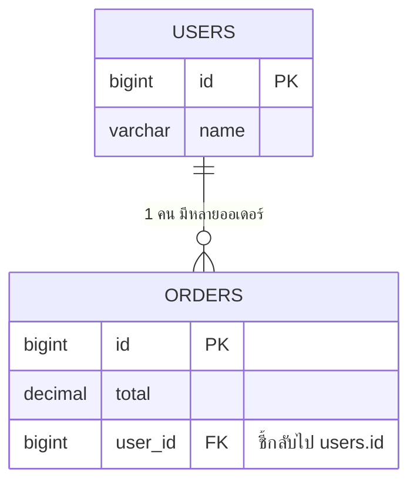

# บทที่ 5: JPA Relationships — เชื่อมความสัมพันธ์ระหว่างตาราง


ในฐานข้อมูลจริง ตารางมักเชื่อมกัน เช่น ผู้ใช้ 1 คน มีได้หลายออเดอร์
JPA ใช้ annotation บอกความสัมพันธ์เหล่านี้:

| Annotation | ความสัมพันธ์ | ตัวอย่าง |
|---|---|---|
| `@OneToOne` | 1 ต่อ 1 | User ↔ Profile (คนละ 1 โปรไฟล์) |
| `@OneToMany` | 1 ต่อ หลาย | User → Orders (1 คนมีหลายออเดอร์) |
| `@ManyToOne` | หลาย ต่อ 1 | Orders → User (หลายออเดอร์เป็นของคนเดียว) |
| `@ManyToMany` | หลาย ต่อ หลาย | Student ↔ Course (นักเรียนลงหลายวิชา วิชามีหลายคน) |
| `@JoinColumn` | ระบุชื่อ column ที่เป็น foreign key | `user_id` |

## ตัวอย่าง: User มีหลาย Order

```java
@Entity
public class User {
    @Id
    @GeneratedValue(strategy = GenerationType.IDENTITY)
    private Long id;

    private String name;

    // 1 User มีหลาย Order
    // mappedBy = "user" หมายถึง field ชื่อ user ใน class Order เป็นเจ้าของความสัมพันธ์
    @OneToMany(mappedBy = "user", cascade = CascadeType.ALL)
    private List<Order> orders = new ArrayList<>();
}
```

```java
@Entity
@Table(name = "orders")
public class Order {
    @Id
    @GeneratedValue(strategy = GenerationType.IDENTITY)
    private Long id;

    private BigDecimal total;

    // หลาย Order เป็นของ User คนเดียว
    // ฝั่งนี้คือ "เจ้าของ" — ตาราง orders จะมี column user_id เก็บ foreign key
    @ManyToOne(fetch = FetchType.LAZY)
    @JoinColumn(name = "user_id")
    private User user;
}
```

**โครงสร้างตารางที่ได้:**



## 2 คำที่ต้องรู้

- **`fetch = FetchType.LAZY`** — ยังไม่โหลดข้อมูลฝั่งตรงข้ามจนกว่าจะเรียกใช้จริง (แนะนำให้ใช้เสมอ ป้องกัน query เกินจำเป็น)
- **`cascade = CascadeType.ALL`** — ทำอะไรกับ User ให้ทำกับ orders ของเขาด้วย เช่น ลบ User → ลบ orders ตาม

> ⚠️ ข้อควรระวังยอดฮิต: ถ้าแปลง Entity ที่มีความสัมพันธ์เป็น JSON ตรง ๆ อาจเกิด **loop ไม่รู้จบ** (User → Order → User → ...) ทางแก้ที่ดีคือสร้าง **DTO** (class แยกสำหรับตอบ response — ดูรายละเอียดใน [บทที่ 11](11-production-ready.md)) แทนการส่ง Entity ออกไปตรง ๆ


---

⬅️ [บทที่ 4: เริ่มโปรเจกต์แรก](04-first-project.md) | [🏠 สารบัญ](../README.md) | [บทที่ 6: JPA ขั้นกลาง](06-jpa-intermediate.md) ➡️
