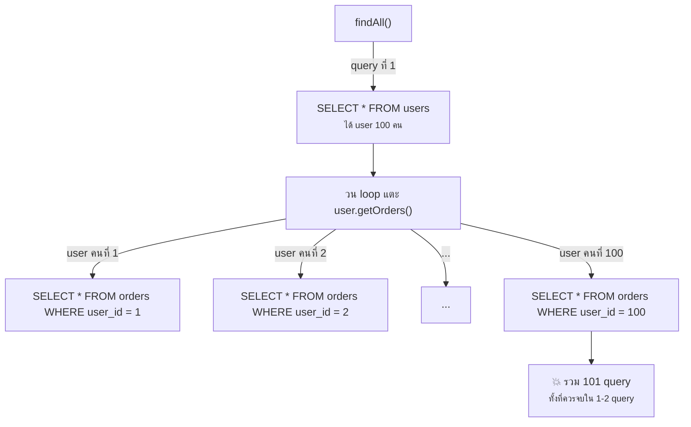
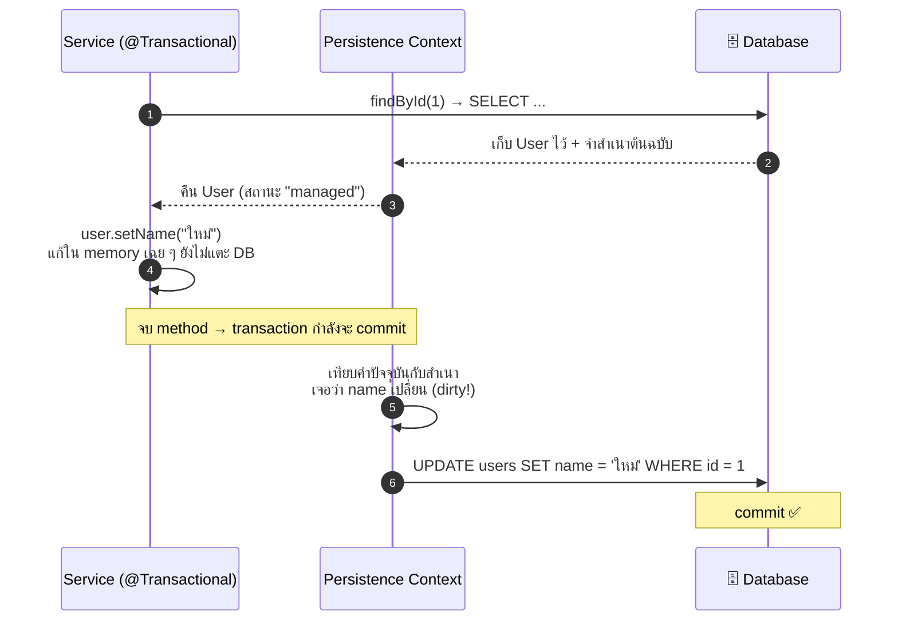
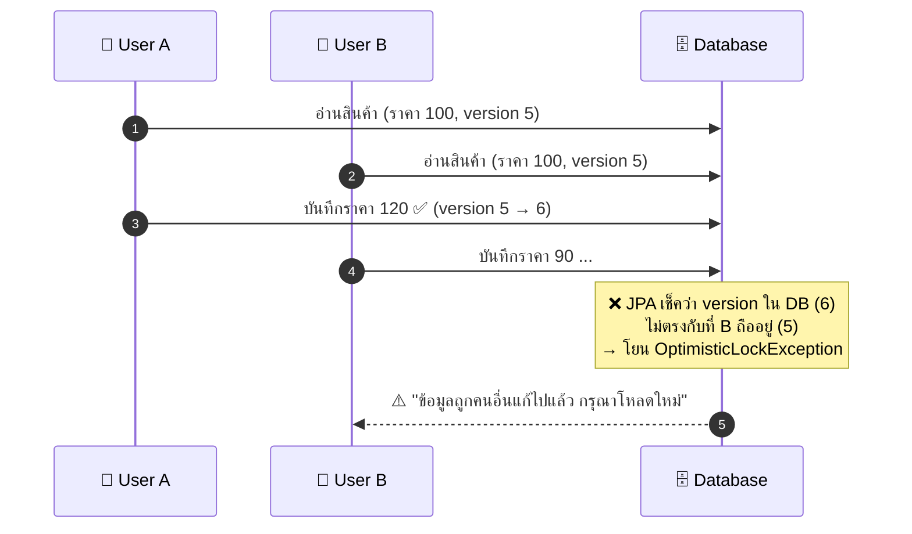

# บทที่ 6: JPA ขั้นกลาง — สิ่งที่เจอเมื่อแอปโตขึ้น

> บทที่ 5 ทำให้เราใช้ JPA เป็น — บทนี้ทำให้เราใช้ JPA **โดยไม่โดนมันเล่นงาน**
> ทุกเรื่องในบทนี้คือปัญหาที่เจอจริงเมื่อข้อมูลเริ่มเยอะและมีผู้ใช้พร้อมกันหลายคน

---

## 1. ปัญหา N+1 Query — กับดัก performance เบอร์หนึ่งของ JPA

### ปัญหาคืออะไร?

โค้ดหน้าตาธรรมดามาก แต่แอบยิง SQL เป็นร้อย query:

```java
List<User> users = userRepository.findAll();      // query ที่ 1: SELECT * FROM users

for (User user : users) {
    // ทุกครั้งที่แตะ orders ของ user คนใหม่ → JPA ยิง query เพิ่ม 1 ครั้ง!
    System.out.println(user.getOrders().size());  // query ที่ 2, 3, 4, ..., N+1
}
```

ถ้ามี user 100 คน = **101 query** — เพราะ `@OneToMany` เป็น LAZY (ดี — ไม่โหลดถ้าไม่ใช้)
แต่พอเราวนใช้ทีละคน มันเลยโหลดทีละคน:



**ทำไมถึงอันตราย:** ตอน dev ข้อมูลน้อย ไม่รู้สึกอะไร — พอขึ้น production ข้อมูลโตขึ้น แอปช้าลงเรื่อย ๆ โดยโค้ดไม่เปลี่ยนสักบรรทัด

### วิธีตรวจจับ

เปิด log SQL ตอน dev แล้วสังเกตว่า query เดิมซ้ำ ๆ ต่างแค่ id ไหม:

```properties
# application-dev.properties (เปิดเฉพาะ dev — ห้ามเปิดใน prod)
spring.jpa.show-sql=true
logging.level.org.hibernate.orm.jdbc.bind=TRACE
```

### วิธีแก้ที่ 1: JOIN FETCH

บอก JPA ตรง ๆ ว่า "ดึง orders มาพร้อมกันเลยใน query เดียว":

```java
public interface UserRepository extends JpaRepository<User, Long> {

    @Query("SELECT u FROM User u JOIN FETCH u.orders")
    List<User> findAllWithOrders();
    // → SELECT ... FROM users u INNER JOIN orders o ON o.user_id = u.id  (query เดียวจบ!)
}
```

| ✅ ข้อดี | ❌ ข้อเสีย |
|---|---|
| จบใน query เดียว ควบคุมได้เต็มที่ | ต้องเขียน JPQL เอง |
| เห็นชัดเจนในโค้ดว่า query นี้ดึงอะไรมาบ้าง | `INNER JOIN` ทำให้ user ที่**ไม่มี** order หายไปจากผลลัพธ์ — ต้องใช้ `LEFT JOIN FETCH` ถ้าอยากได้ครบ |
| — | JOIN FETCH หลาย collection พร้อมกัน (`orders` + `addresses`) จะ error `MultipleBagFetchException` |

### วิธีแก้ที่ 2: @EntityGraph

ผลเหมือน JOIN FETCH แต่เขียนเป็น annotation ไม่ต้องแตะ JPQL:

```java
public interface UserRepository extends JpaRepository<User, Long> {

    @EntityGraph(attributePaths = {"orders"})
    List<User> findAll();   // override findAll เดิมให้ fetch orders มาด้วย
}
```

| ✅ ข้อดี | ❌ ข้อเสีย |
|---|---|
| ไม่ต้องเขียน JPQL — ใช้กับ query method เดิมได้เลย | ซ่อนรายละเอียด — คนอ่านต้องรู้ว่า annotation นี้เปลี่ยนพฤติกรรม query |
| ใช้เป็น `LEFT JOIN` ให้อัตโนมัติ (user ไม่มี order ไม่หาย) | ปรับแต่งเงื่อนไขซับซ้อนไม่ได้เท่าเขียน JPQL เอง |

### แล้วใช้ตัวไหนดี?

- query ง่าย ๆ อยากให้ fetch เพิ่ม → **@EntityGraph** (เขียนน้อย อ่านง่าย)
- query มีเงื่อนไขซับซ้อนอยู่แล้ว → **JOIN FETCH** (คุมได้เต็มที่ในที่เดียว)
- ดึงข้อมูลเยอะมากไปแสดงผลอย่างเดียว → พิจารณา **Projection** (หัวข้อ 6) แทนการดึง Entity ทั้งก้อน

> 📌 หลักคิด: **LAZY คือค่า default ที่ถูกต้องแล้ว** — อย่าแก้ N+1 ด้วยการเปลี่ยนเป็น EAGER เด็ดขาด เพราะเท่ากับบังคับโหลดทุกที่ทั้งที่ส่วนใหญ่ไม่ใช้ (ปัญหาย้ายจาก "ช้าบางจุด" เป็น "ช้าทุกจุด") ให้แก้เป็นราย query ที่ต้องใช้จริงด้วยสองวิธีข้างบน

---

## 2. @Query — เมื่อชื่อ method ไม่พอ

### ปัญหาคืออะไร?

Query จากชื่อ method (บทที่ 5) ดีมากตอนเงื่อนไขเรียบง่าย แต่พอเงื่อนไขซับซ้อนขึ้น ชื่อ method จะประหลาดจนอ่านไม่รู้เรื่อง:

```java
// 😵 ใครอ่านออกบ้าง?
List<Order> findByTotalGreaterThanAndStatusInAndUserNameContainingIgnoreCaseOrderByCreatedAtDesc(...);
```

### ทางออก: เขียน query เองด้วย @Query (ภาษา JPQL)

**JPQL** หน้าตาคล้าย SQL แต่ query กับ **Entity/field** แทนตาราง/column:

```java
public interface OrderRepository extends JpaRepository<Order, Long> {

    // JPQL — อ้างชื่อ class (Order) และชื่อ field (total, status) ไม่ใช่ชื่อตาราง
    @Query("""
           SELECT o FROM Order o
           WHERE o.total > :minTotal
             AND o.status IN :statuses
             AND LOWER(o.user.name) LIKE LOWER(CONCAT('%', :name, '%'))
           ORDER BY o.createdAt DESC
           """)
    List<Order> searchOrders(@Param("minTotal") BigDecimal minTotal,
                             @Param("statuses") List<OrderStatus> statuses,
                             @Param("name") String name);
}
```

### Native Query — เมื่อต้องใช้ความสามารถเฉพาะของ database

ถ้าต้องใช้ฟีเจอร์ที่ JPQL ไม่มี (เช่น window function, full-text search ของ PostgreSQL):

```java
@Query(value = """
       SELECT * FROM orders
       WHERE to_tsvector('simple', note) @@ to_tsquery(:keyword)
       """, nativeQuery = true)   // ← เขียน SQL ตรง ๆ ของ database นั้น
List<Order> fullTextSearch(@Param("keyword") String keyword);
```

### @Modifying — สำหรับ UPDATE / DELETE

`@Query` ปกติใช้ได้แค่ SELECT — ถ้าจะแก้ข้อมูลต้องเพิ่ม `@Modifying` และครอบด้วย transaction:

```java
@Modifying
@Transactional
@Query("UPDATE Order o SET o.status = 'CANCELLED' WHERE o.createdAt < :cutoff AND o.status = 'PENDING'")
int cancelStaleOrders(@Param("cutoff") LocalDateTime cutoff);   // คืนจำนวนแถวที่โดนแก้
```

> ⚠️ ระวัง: `@Modifying` ยิง SQL ตรงเข้า database **ข้าม persistence context** — Entity ที่โหลดค้างไว้ในหน่วยความจำจะไม่รู้ว่าข้อมูลเปลี่ยน (ดูหัวข้อ 3) ถ้าจะใช้ต่อในเมธอดเดียวกัน ให้เพิ่ม `@Modifying(clearAutomatically = true)`

### เปรียบเทียบ 3 วิธี

| วิธี | ✅ ข้อดี | ❌ ข้อเสีย | เหมาะกับ |
|---|---|---|---|
| **ชื่อ method** (`findByName`) | เขียนสั้น ไม่ต้องรู้ JPQL, refactor ชื่อ field แล้ว error ตอน compile | เงื่อนไขซับซ้อนแล้วชื่อยาวเกินอ่าน | เงื่อนไข 1–2 ตัว |
| **@Query (JPQL)** | คุม query ได้เต็มที่ อ่านง่าย, ยังไม่ผูกกับ database ยี่ห้อใด | ผิด syntax รู้ตอน start แอป (ไม่ใช่ตอน compile) | เงื่อนไขซับซ้อน, JOIN FETCH |
| **Native Query** | ใช้ฟีเจอร์เฉพาะ database ได้หมด | ผูกติดกับ database ยี่ห้อนั้น ย้ายยาก, ไม่รู้จัก Entity mapping บางส่วน | ฟีเจอร์เฉพาะ เช่น full-text search |

หลักเลือก: **เริ่มจากชื่อ method → เกิน 2 เงื่อนไขค่อยขยับไป JPQL → Native เป็นทางเลือกสุดท้าย**

---

## 3. Persistence Context และ Dirty Checking — ทำไมไม่เรียก save() ก็บันทึก?

### พฤติกรรมที่มือใหม่งงที่สุดของ JPA

```java
@Transactional
public void renameUser(Long id, String newName) {
    User user = userRepository.findById(id).orElseThrow();
    user.setName(newName);
    // จบ method — ไม่มี save() สักบรรทัด...
    // แต่ข้อมูลใน database เปลี่ยน! 😱
}
```

ไม่ใช่ bug — นี่คือฟีเจอร์ชื่อ **Dirty Checking**

### กลไกเบื้องหลัง

Entity ทุกตัวที่โหลดผ่าน repository **ภายใน transaction** จะถูกเก็บใน **Persistence Context**
(พื้นที่จำชั่วคราวของ JPA) พร้อม "สำเนาต้นฉบับ" — พอ transaction จะ commit JPA เอาค่าปัจจุบันเทียบกับต้นฉบับ ตัวไหน "เลอะ" (dirty = ถูกแก้) ก็ยิง UPDATE ให้เอง:



### สถานะของ Entity ที่ต้องรู้

| สถานะ | ความหมาย | Dirty Checking ทำงานไหม |
|---|---|---|
| **Managed** | โหลดมาภายใน transaction — อยู่ใน Persistence Context | ✅ แก้แล้วบันทึกอัตโนมัติ |
| **Detached** | หลุดจาก context แล้ว (เช่น โหลดนอก transaction / transaction จบไปแล้ว) | ❌ แก้แล้วเงียบ ไม่บันทึก |
| **Transient** | object ใหม่ที่เพิ่ง `new` ยังไม่เคยแตะ database | ❌ ต้อง `save()` เท่านั้น |

### แล้วตกลงต้องเรียก save() เมื่อไหร่?

```java
// ✅ ต้อง save — object ใหม่ (transient)
User user = new User("John");
userRepository.save(user);

// ✅ ไม่ต้อง save — managed entity ใน @Transactional (dirty checking จัดการให้)
@Transactional
public void rename(Long id, String name) {
    userRepository.findById(id).orElseThrow().setName(name);
}

// ⚠️ ต้อง save — เพราะอยู่นอก transaction, entity เป็น detached
public void renameNoTx(Long id, String name) {
    User user = userRepository.findById(id).orElseThrow();  // transaction จบตรงนี้แล้ว
    user.setName(name);            // แก้บน detached — เงียบหาย!
    userRepository.save(user);     // ต้องสั่งเองถึงจะบันทึก
}
```

| ✅ ข้อดีของ Dirty Checking | ❌ ข้อเสีย / สิ่งที่ต้องระวัง |
|---|---|
| โค้ดสะอาด — แก้ Entity เหมือนแก้ object ธรรมดา | คนไม่รู้กลไกจะเจอ "ข้อมูลเปลี่ยนเองทั้งที่ไม่ได้สั่ง save" |
| JPA รวบ UPDATE ให้ตอน commit ทีเดียว มีประสิทธิภาพ | แก้ Entity แบบตั้งใจแค่ชั่วคราว (เช่น ปรับค่าเพื่อคำนวณ) → โดนบันทึกจริงโดยไม่รู้ตัว! |
| — | พฤติกรรมต่างกันใน/นอก transaction ทำให้ bug ตามหายาก |

> 📌 หลักปฏิบัติ: **อย่าแก้ค่า Entity ถ้าไม่ต้องการให้บันทึก** — ถ้าต้องคำนวณชั่วคราว ให้ copy ค่าออกมาใส่ตัวแปรอื่นหรือใช้ DTO แทน

---

## 4. Auditing — ให้ JPA ประทับเวลาให้เองทุกตาราง

งานจริงแทบทุกตารางต้องมี "สร้างเมื่อไหร่ แก้ล่าสุดเมื่อไหร่" — อย่าเซ็ตเองทีละจุด ให้ JPA ทำ:

```java
// 1. เปิดสวิตช์ที่ config
@Configuration
@EnableJpaAuditing
public class JpaConfig {}
```

```java
// 2. สร้าง base class กลาง — @MappedSuperclass = field เหล่านี้ไปโผล่ในตารางลูก
@MappedSuperclass
@EntityListeners(AuditingEntityListener.class)
public abstract class BaseEntity {

    @CreatedDate
    @Column(updatable = false)          // ห้ามแก้หลังสร้าง
    private LocalDateTime createdAt;

    @LastModifiedDate
    private LocalDateTime updatedAt;
}
```

```java
// 3. Entity ไหนอยากได้ ก็ extends เอา
@Entity
public class Order extends BaseEntity {
    @Id @GeneratedValue(strategy = GenerationType.IDENTITY)
    private Long id;
    // ... สร้าง/แก้เมื่อไหร่ createdAt, updatedAt ถูกเซ็ตให้อัตโนมัติ
}
```

ถ้าใช้คู่กับ Spring Security ยังเก็บ "ใครทำ" ได้ด้วย `@CreatedBy` / `@LastModifiedBy` (ต้อง config `AuditorAware` เพิ่มเพื่อบอกว่า user ปัจจุบันคือใคร)

| ✅ ข้อดี | ❌ ข้อเสีย |
|---|---|
| เขียนครั้งเดียวใช้ทุกตาราง ไม่มีวันลืมเซ็ต | เวลามาจากเครื่องแอป ไม่ใช่ database — ถ้ามีแอปหลายเครื่องเวลาต้องตรงกัน (ใช้ NTP) |
| ตอบคำถาม audit ได้ทันที: แถวนี้ใครสร้าง/แก้เมื่อไหร่ | ทำงานเฉพาะการแก้ผ่าน JPA — ยิง SQL ตรง (`@Modifying`, Flyway script) จะไม่อัปเดตให้ |

---

## 5. Optimistic Locking (@Version) — กันข้อมูลชนกันเมื่อแก้พร้อมกัน

### ปัญหาคืออะไร?

สองคนเปิดหน้าแก้ไขสินค้าตัวเดียวกันพร้อมกัน — คนที่กด save ทีหลัง**ทับ**ของคนแรกเงียบ ๆ (Lost Update):



### วิธีใช้ — เพิ่ม field เดียวจบ

```java
@Entity
public class Product {
    @Id @GeneratedValue(strategy = GenerationType.IDENTITY)
    private Long id;

    private BigDecimal price;

    @Version              // ← เพิ่มบรรทัดเดียว JPA จัดการที่เหลือให้หมด
    private Long version;
}
```

ทุกครั้งที่ UPDATE JPA จะแอบเติมเงื่อนไขให้: `UPDATE ... WHERE id = ? AND version = ?` แล้วบวก version ขึ้น 1 — ถ้าไม่มีแถวไหนโดนแก้ (แปลว่าคนอื่นชิงแก้ไปก่อน) ก็โยน `OptimisticLockException` ให้เราจัดการ:

```java
@RestControllerAdvice
public class GlobalExceptionHandler {

    @ExceptionHandler(ObjectOptimisticLockingFailureException.class)
    public ResponseEntity<String> handleConflict(Exception ex) {
        return ResponseEntity.status(HttpStatus.CONFLICT)   // 409
                .body("ข้อมูลถูกแก้ไขโดยผู้ใช้อื่นแล้ว กรุณาโหลดหน้าใหม่");
    }
}
```

### Optimistic vs Pessimistic Locking

| | **Optimistic** (`@Version`) | **Pessimistic** (`@Lock` — ล็อกแถวใน DB) |
|---|---|---|
| แนวคิด | "คงไม่ชนกันหรอก ถ้าชนค่อย error" | "กันไว้ก่อน — ล็อกแถวจนกว่าฉันจะเสร็จ" |
| ✅ ข้อดี | ไม่ล็อกอะไรเลย เร็ว รองรับคนเยอะ | ไม่มีทาง conflict — คนหลังต้องรอคนแรกเสร็จ |
| ❌ ข้อเสีย | ผู้ใช้ที่ชนต้องทำรายการใหม่ | ช้า — แถวโดนล็อก คนอื่นค้างรอ, เสี่ยง deadlock |
| เหมาะกับ | งานทั่วไปที่นาน ๆ ชนที (แก้โปรไฟล์, แก้สินค้า) | เงินและสต๊อกที่ชนบ่อยและพลาดไม่ได้ (ตัดยอด, จองที่นั่ง) |

> 📌 งาน CRUD ทั่วไป: ใส่ `@Version` ไว้เถอะ ต้นทุนแค่ 1 column แต่กัน Lost Update ได้ทั้งระบบ

---

## 6. Projection — ดึงเฉพาะ column ที่ใช้ ไม่ต้องแบกทั้ง Entity

### ปัญหาคืออะไร?

หน้า list สินค้าต้องการแค่ `id, name, price` แต่ `findAll()` ดึง**ทุก column** รวม description ยาว ๆ, รูป base64 ฯลฯ — เปลืองทั้ง memory และ network โดยไม่ได้ใช้

### วิธีที่ 1: Interface Projection (ง่ายสุด)

```java
// ประกาศ interface ที่มีแค่ getter ของ field ที่อยากได้
public interface ProductSummary {
    Long getId();
    String getName();
    BigDecimal getPrice();
}

public interface ProductRepository extends JpaRepository<Product, Long> {
    // Spring Data เห็น return type เป็น projection → SELECT เฉพาะ 3 column นี้ให้เอง!
    List<ProductSummary> findByCategory(String category);
}
```

### วิธีที่ 2: Record + JPQL (ชัดเจนสุด)

```java
public record ProductSummaryDto(Long id, String name, BigDecimal price) {}

public interface ProductRepository extends JpaRepository<Product, Long> {

    @Query("SELECT new com.example.dto.ProductSummaryDto(p.id, p.name, p.price) " +
           "FROM Product p WHERE p.category = :category")
    List<ProductSummaryDto> findSummaries(@Param("category") String category);
}
```

| วิธี | ✅ ข้อดี | ❌ ข้อเสีย |
|---|---|---|
| **Interface Projection** | เขียนน้อยมาก, ใช้กับ query method เดิมได้ | เป็น proxy — debug ดูค่ายากกว่า, ชื่อ getter ต้องตรงกับ field เป๊ะ |
| **Record + JPQL** | ได้ object จริง ใช้ต่อได้ทุกที่, เห็นชัดว่า query อะไร | ต้องเขียน JPQL + ระบุ package เต็ม ยาวกว่า |
| **ดึง Entity เต็ม** (เดิม) | ง่าย, ได้ครบทุก field, แก้ค่าต่อได้ (managed) | หนัก — โหลดทุก column + เสี่ยง N+1 จากความสัมพันธ์ |

หลักเลือก: **หน้าจอแสดงผลอย่างเดียว → Projection / จะแก้ไขข้อมูล → Entity เต็ม** (เพราะ dirty checking ทำงานกับ Entity เท่านั้น)

---

## สรุปบทนี้ — checklist ก่อนขึ้น production

| เรื่อง | ถามตัวเอง | ถ้ายัง → ใช้อะไร |
|---|---|---|
| N+1 | เปิด `show-sql` แล้วเห็น query ซ้ำ ๆ ต่าง id ไหม? | `JOIN FETCH` / `@EntityGraph` |
| Query ซับซ้อน | ชื่อ method ยาวจนอ่านไม่รู้เรื่องหรือยัง? | `@Query` (JPQL) |
| Dirty Checking | รู้ไหมว่า method ไหนแก้ Entity แล้วบันทึกอัตโนมัติ? | ทวนหัวข้อ 3 + อย่าแก้ Entity เล่น ๆ |
| Auditing | ทุกตารางมี createdAt/updatedAt ไหม? | `BaseEntity` + `@EnableJpaAuditing` |
| แก้ชนกัน | ถ้าสองคนกด save พร้อมกัน ใครชนะ? รู้ตัวไหม? | `@Version` |
| ดึงข้อมูลเกิน | หน้า list ดึงทุก column มาทั้งที่ใช้ 3 ตัวหรือเปล่า? | Projection |

> 💡 เรื่องทั้งบทนี้มีจุดร่วมเดียวกัน: **JPA ซ่อนการยิง SQL ไว้เบื้องหลัง** — สะดวกมากตอนเริ่ม แต่พอแอปโตต้องกลับมาดูว่ามันยิงอะไรจริง ๆ เปิด `show-sql` ตอน dev ไว้เสมอแล้วจะเห็นทุกปัญหาก่อนผู้ใช้เห็น

---

⬅️ [บทที่ 5: JPA Relationships](05-jpa-relationships.md) | [🏠 สารบัญ](../README.md) | [บทที่ 7: การเขียน Test](07-testing.md) ➡️
