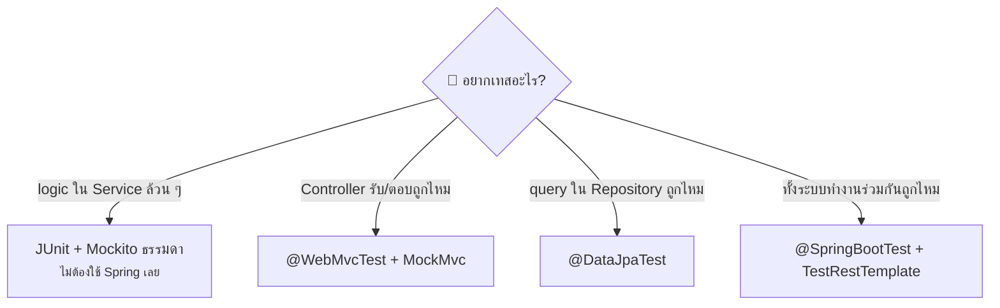

# บทที่ 7: การเขียน Test


Spring Boot มีเครื่องมือเทสมาให้ครบ (อยู่ใน `spring-boot-starter-test` ซึ่งติดมากับทุกโปรเจกต์)

| Annotation | ใช้เทสอะไร | ความเร็ว |
|---|---|---|
| `@SpringBootTest` | ทั้งแอป (โหลด Bean ทุกตัว) | ช้า |
| `@WebMvcTest(XxxController.class)` | เฉพาะ Controller ชั้นเดียว | เร็ว |
| `@DataJpaTest` | เฉพาะ Repository + database | เร็ว |
| `@MockitoBean` | แทนที่ Bean จริงด้วยตัวปลอม (mock) | — |

> 💡 หลักการเลือก: **เทสให้แคบที่สุดเท่าที่ทำได้** — เทส Controller ใช้ `@WebMvcTest`, เทส Repository ใช้ `@DataJpaTest`, ใช้ `@SpringBootTest` เฉพาะตอนอยากเทสภาพรวมจริง ๆ

## 1. เทส Controller ด้วย @WebMvcTest

โหลดแค่ Controller ตัวเดียว ส่วน Service ใช้ตัวปลอม (mock) แทน:

```java
@WebMvcTest(UserController.class)
class UserControllerTest {

    @Autowired
    private MockMvc mockMvc;          // ตัวจำลองการยิง HTTP request

    @MockitoBean
    private UserService userService;  // Service ปลอม — กำหนดพฤติกรรมเองได้

    @Test
    void getUser_returnsUser() throws Exception {
        // กำหนดว่าถ้า service ถูกเรียก ให้ตอบอะไร
        given(userService.findById(1L)).willReturn(new User(1L, "John"));

        // ยิง GET /api/users/1 แล้วตรวจคำตอบ
        mockMvc.perform(get("/api/users/1"))
               .andExpect(status().isOk())
               .andExpect(jsonPath("$.name").value("John"));
    }
}
```

## 2. เทส Repository ด้วย @DataJpaTest

โหลดเฉพาะชั้น JPA และใช้ database ในหน่วยความจำ (H2) อัตโนมัติ:

```java
@DataJpaTest
class UserRepositoryTest {

    @Autowired
    private UserRepository userRepository;

    @Test
    void findByName_returnsMatchingUser() {
        userRepository.save(new User("John", "john@mail.com"));

        List<User> result = userRepository.findByName("John");

        assertThat(result).hasSize(1);
        assertThat(result.get(0).getEmail()).isEqualTo("john@mail.com");
    }
}
```

## 3. เทสทั้งแอปด้วย @SpringBootTest

```java
@SpringBootTest(webEnvironment = SpringBootTest.WebEnvironment.RANDOM_PORT)
class UserApiIntegrationTest {

    @Autowired
    private TestRestTemplate restTemplate;  // client สำหรับยิง API จริง

    @Test
    void createUser_thenFetchIt() {
        var request = new CreateUserRequest("John", "john@mail.com");

        var created = restTemplate.postForEntity("/api/users", request, User.class);
        assertThat(created.getStatusCode()).isEqualTo(HttpStatus.OK);

        var fetched = restTemplate.getForEntity("/api/users/" + created.getBody().getId(), User.class);
        assertThat(fetched.getBody().getName()).isEqualTo("John");
    }
}
```

**Flow การเลือกชนิดเทส:**



## 4. Annotation ฝั่งเทสทั้งหมด (ไม่ได้มีแค่ @MockitoBean!)

annotation ที่ใช้ในไฟล์เทสมาจาก 3 ที่: **JUnit 5** (ควบคุมการรันเทส), **Mockito** (สร้างตัวปลอม), และ **Spring** (ปรับสภาพแวดล้อมเทส)

### กลุ่มที่ 1: JUnit 5 — ควบคุมการรันเทส

| Annotation | ความหมาย |
|---|---|
| `@Test` | method นี้คือเทส 1 เคส |
| `@BeforeEach` / `@AfterEach` | รันก่อน/หลังเทส **ทุกเคส** (เตรียม/เคลียร์ข้อมูล) |
| `@BeforeAll` / `@AfterAll` | รันครั้งเดียวก่อน/หลังเทส **ทั้ง class** |
| `@DisplayName("...")` | ตั้งชื่อเทสให้อ่านง่าย |
| `@Disabled` | ข้ามเทสนี้ชั่วคราว |
| `@ParameterizedTest` + `@ValueSource` | รันเทสเดิมซ้ำด้วยข้อมูลหลายชุด |

```java
class CalculatorTest {

    @BeforeEach
    void setUp() { ... }  // รันก่อนทุก @Test

    @Test
    @DisplayName("บวกเลขสองตัวได้ผลถูกต้อง")
    void addsTwoNumbers() { ... }

    @ParameterizedTest
    @ValueSource(ints = {1, 5, 100})   // รัน 3 รอบด้วยค่า 1, 5, 100
    void acceptsPositiveNumbers(int value) { ... }
}
```

### กลุ่มที่ 2: Mockito ล้วน ๆ — เทส Service โดยไม่โหลด Spring (เร็วสุด)

| Annotation | ความหมาย |
|---|---|
| `@ExtendWith(MockitoExtension.class)` | เปิดใช้ Mockito กับ JUnit 5 |
| `@Mock` | สร้าง object ปลอม |
| `@InjectMocks` | สร้าง object จริงที่จะเทส แล้วยัด mock เข้าไปให้ |

```java
@ExtendWith(MockitoExtension.class)   // ไม่มี Spring context เลย — รันเร็วมาก
class UserServiceTest {

    @Mock
    UserRepository userRepository;     // ตัวปลอม

    @InjectMocks
    UserService userService;           // ตัวจริงที่เทส (Mockito ยัด mock ให้)

    @Test
    void findById_returnsUser() {
        given(userRepository.findById(1L)).willReturn(Optional.of(new User(1L, "John")));

        User result = userService.findById(1L);

        assertThat(result.getName()).isEqualTo("John");
    }
}
```

> 💡 **`@Mock` vs `@MockitoBean` ต่างกันยังไง?**
> - `@Mock` — ใช้ตอน**ไม่มี** Spring context (เทสแบบกลุ่มนี้)
> - `@MockitoBean` — ใช้ตอน**มี** Spring context (เช่นใน `@WebMvcTest`) — มันเข้าไป**แทนที่ Bean จริง**ในตู้ ApplicationContext

### กลุ่มที่ 3: Spring — ปรับสภาพแวดล้อมเทส

| Annotation | ความหมาย |
|---|---|
| `@MockitoBean` | แทนที่ Bean จริงใน context ด้วยตัวปลอม |
| `@MockitoSpyBean` | ใช้ Bean จริง แต่ override เฉพาะบาง method ได้ |
| `@ActiveProfiles("test")` | รันเทสด้วย profile test (ใช้ `application-test.properties`) |
| `@TestPropertySource` | override ค่า config เฉพาะเทสนี้ |
| `@Sql("/seed-data.sql")` | รันสคริปต์ SQL เตรียมข้อมูลก่อนเทส |
| `@Transactional` (บนเทส) | ทุกเคส rollback อัตโนมัติหลังจบ — ข้อมูลไม่ค้างใน DB |
| `@AutoConfigureMockMvc` | ใช้ MockMvc ร่วมกับ `@SpringBootTest` ได้ |
| `@TestConfiguration` | ประกาศ Bean เฉพาะสำหรับเทส |
| `@DirtiesContext` | สร้าง context ใหม่หลังเทสนี้ (ใช้เมื่อเทสไปแก้ state ของ Bean) |

### กลุ่มที่ 4: เทสเฉพาะทาง

| Annotation | ความหมาย |
|---|---|
| `@JsonTest` | เทสการแปลง JSON อย่างเดียว |
| `@RestClientTest` | เทส class ที่ยิง API ออกไปข้างนอก (มี mock server ให้) |
| `@WithMockUser(roles = "ADMIN")` | จำลอง user ที่ login แล้ว — ใช้เทสร่วมกับ Spring Security |
| `@Testcontainers` + `@ServiceConnection` | รัน database จริง (PostgreSQL, Redis) ใน Docker ตอนเทส |

```java
// ตัวอย่าง: เทส endpoint ที่ล็อกไว้เฉพาะ ADMIN
@WebMvcTest(AdminController.class)
class AdminControllerTest {

    @Autowired MockMvc mockMvc;

    @Test
    @WithMockUser(roles = "ADMIN")   // จำลองว่า login เป็น ADMIN แล้ว
    void adminCanAccess() throws Exception {
        mockMvc.perform(get("/api/admin/stats"))
               .andExpect(status().isOk());
    }

    @Test
    @WithMockUser(roles = "USER")    // USER ธรรมดาต้องโดน 403
    void userIsForbidden() throws Exception {
        mockMvc.perform(get("/api/admin/stats"))
               .andExpect(status().isForbidden());
    }
}
```

> 📌 หมายเหตุ: `@Autowired` ในไฟล์เทสไม่ใช่ annotation พิเศษของการเทส — มันคือการขอ Bean จาก Spring ตามปกติ แค่ในเทสต้องใช้กับ field เพราะ JUnit เป็นคนสร้าง class เทสเอง ไม่ได้สร้างผ่าน constructor ของ Spring

**ชุดที่ใช้บ่อยจริงในงาน:** `@Test`, `@BeforeEach`, `@Mock`/`@InjectMocks` (เทส Service), `@MockitoBean` + MockMvc (เทส Controller), `@ActiveProfiles("test")` และ `@WithMockUser` เมื่อมี Security


---

⬅️ [บทที่ 6: JPA ขั้นกลาง](06-jpa-intermediate.md) | [🏠 สารบัญ](../README.md) | [บทที่ 8: Spring Security](08-security.md) ➡️
