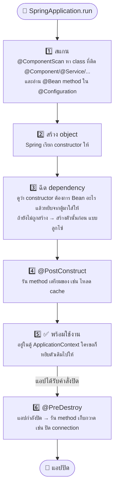
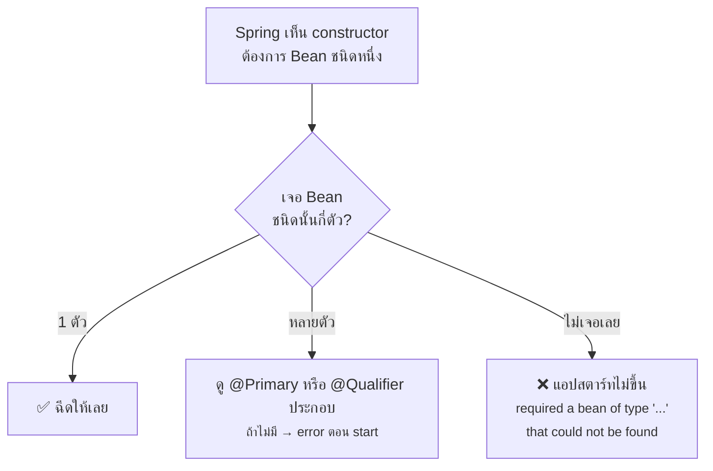
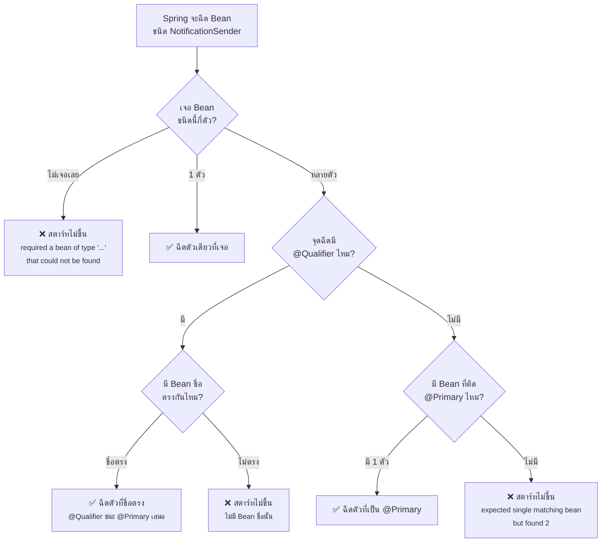

# บทที่ 8: เจาะลึก Bean — ทำงานยังไงกันแน่?


> ต่อยอดจากเรื่อง DI ใน [บทที่ 3](03-annotations.md) — เข้าใจ Bean แล้วจะเข้าใจว่าทำไม annotation ทั้งหมดถึงทำงานได้

## 1. Bean คืออะไร?

**Bean = object ที่ Spring เป็นคนสร้างและดูแลให้** แทนที่เราจะ `new` เอง

```java
// ❌ Java ธรรมดา — สร้างเองทุกตัว จัดการเองว่าใครต้องใช้ใคร
UserRepository repo = new UserRepository();
UserService service = new UserService(repo);
UserController controller = new UserController(service);

// ✅ Spring — แค่ติด annotation แล้ว Spring สร้าง + เชื่อมให้เองทั้งหมด
@Service
public class UserService { ... }
```

Object พวกนี้ถูกเก็บไว้ในตู้กลางชื่อ **ApplicationContext** (หรือเรียกว่า **IoC Container**)

> 💡 **IoC (Inversion of Control) = การกลับด้านของการควบคุม**
> จากเดิม "โค้ดเราควบคุมการสร้าง object" → กลายเป็น "Spring ควบคุมให้ เราแค่ประกาศว่าต้องการอะไร"

## 2. วงจรชีวิตของ Bean (Bean Lifecycle)



```java
@Service
public class CacheService {

    @PostConstruct          // รันครั้งเดียว หลัง Bean สร้างเสร็จและฉีด dependency ครบแล้ว
    public void warmUp() {
        System.out.println("โหลดข้อมูลเข้า cache...");
    }

    @PreDestroy             // รันครั้งเดียว ตอนแอปกำลังปิด
    public void cleanUp() {
        System.out.println("เคลียร์ cache ก่อนปิดแอป");
    }
}
```

## 3. Bean เป็น Singleton — จุดที่มือใหม่พลาดบ่อยสุด

โดย default **Bean แต่ละชนิดถูกสร้างแค่ตัวเดียวทั้งแอป** แล้วทุกคนใช้ตัวเดิมร่วมกัน
`UserService` ที่ถูกฉีดเข้า Controller A กับ Controller B คือ **object ตัวเดียวกันเป๊ะ ๆ**

ผลที่ตามมา: **ห้ามเก็บ state ของ user ไว้ใน field ของ Bean** เพราะทุก request แชร์ตัวแปรเดียวกัน — พอมีคนใช้พร้อมกันข้อมูลจะตีกันทันที

```java
@Service
public class OrderService {

    private User currentUser;   // ❌ อันตราย! ทุก request แชร์ field นี้ร่วมกัน

    public BigDecimal calculate(User user, List<Item> items) {  // ✅ รับผ่าน parameter แทน
        ...
    }
}
```

ถ้าต้องการเปลี่ยนพฤติกรรม ใช้ `@Scope`:

| Scope | ความหมาย |
|---|---|
| `singleton` (default) | ตัวเดียวทั้งแอป |
| `prototype` | สร้างใหม่ทุกครั้งที่มีคนขอ |
| `request` | ตัวใหม่ต่อ 1 HTTP request |
| `session` | ตัวใหม่ต่อ 1 user session |

```java
@Service
@Scope("prototype")   // ขอเมื่อไหร่ ได้ตัวใหม่เมื่อนั้น
public class ReportGenerator { ... }
```

## 4. Spring รู้ได้ยังไงว่าต้องฉีด Bean ตัวไหน?

ดูจาก **ชนิด (type)** ของ parameter ใน constructor เป็นหลัก:



## 5. @Qualifier — ชี้ตัว Bean ด้วยชื่อ เมื่อชนิดซ้ำกัน

### ปัญหา: interface เดียว มีหลาย implementation

```java
public interface NotificationSender {
    void send(String to, String message);
}

@Service
public class EmailSender implements NotificationSender { ... }

@Service
public class SmsSender implements NotificationSender { ... }
```

พอมีคนขอ `NotificationSender` — Spring เจอ 2 ตัว เลือกไม่ได้ แอปสตาร์ทไม่ขึ้น:

```
expected single matching bean but found 2: emailSender,smsSender
```

### กุญแจสำคัญ: Bean ทุกตัวมี "ชื่อ"

ถ้าไม่ตั้งเอง Spring ใช้ชื่อ class แบบตัวแรกเป็นตัวเล็ก:

```
EmailSender  →  ชื่อ Bean = "emailSender"
SmsSender    →  ชื่อ Bean = "smsSender"
```

`@Qualifier("ชื่อ")` ที่จุดฉีด = บอกว่า "ฉันขอตัวนี้เท่านั้น":

```java
@Service
public class OrderService {
    private final NotificationSender sender;

    public OrderService(@Qualifier("emailSender") NotificationSender sender) {
        this.sender = sender;      // ✅ ได้ EmailSender แน่นอน
    }
}
```

ตั้งชื่อเองให้สั้นและสื่อความหมายกว่าก็ได้:

```java
@Service("email")   // ตั้งชื่อ Bean ว่า "email"
public class EmailSender implements NotificationSender { ... }

// ตอนฉีด
public OrderService(@Qualifier("email") NotificationSender sender) { ... }
```

ใช้กับ `@Bean` method ได้เหมือนกัน (ชื่อ Bean = ชื่อ method):

```java
@Configuration
public class AppConfig {
    @Bean public RestClient paymentClient() { ... }    // ชื่อ Bean = "paymentClient"
    @Bean public RestClient shippingClient() { ... }   // ชื่อ Bean = "shippingClient"
}

@Service
public class PaymentService {
    public PaymentService(@Qualifier("paymentClient") RestClient client) { ... }
}
```

### Flow การตัดสินใจของ Spring ทั้งหมด



### @Qualifier vs @Primary — ใช้ตัวไหนดี?

| | `@Primary` | `@Qualifier` |
|---|---|---|
| ติดที่ไหน | ที่ **Bean** (ตัวที่เป็นค่า default) | ที่ **จุดฉีด** (ที่ที่ต้องการเจาะจง) |
| ความหมาย | "ถ้าไม่ระบุ ให้ใช้ฉัน" | "ฉันขอตัวนี้เท่านั้น" |
| เหมาะกับ | มีตัวหลักชัดเจน ตัวอื่นเป็นข้อยกเว้น | แต่ละที่ต้องการคนละตัว |

ใช้คู่กันได้: ติด `@Primary` ที่ `EmailSender` เป็น default แล้วจุดไหนอยากได้ SMS ค่อยใส่ `@Qualifier("sms")` เฉพาะจุด

### โบนัส: อยากได้ "ทุกตัว" — ฉีดเป็น List หรือ Map

```java
@Service
public class BroadcastService {

    private final List<NotificationSender> allSenders;   // ได้ทุก implementation

    public BroadcastService(List<NotificationSender> allSenders) {
        this.allSenders = allSenders;
    }

    public void broadcast(String to, String message) {
        allSenders.forEach(s -> s.send(to, message));    // ส่งทุกช่องทาง
    }
}
```

```java
// Map<ชื่อBean, ตัวBean> — เลือกตามเงื่อนไข runtime โดยไม่ต้องเขียน if-else
@Service
public class NotifyService {

    private final Map<String, NotificationSender> senders;  // {"email": ..., "sms": ...}

    public NotifyService(Map<String, NotificationSender> senders) {
        this.senders = senders;
    }

    public void notify(String channel, String to, String message) {
        senders.get(channel).send(to, message);   // user เลือก channel เองจาก request
    }
}
```

## 6. Error ยอดฮิตเกี่ยวกับ Bean

| Error | สาเหตุส่วนใหญ่ | วิธีแก้ |
|---|---|---|
| `required a bean of type '...' that could not be found` | ลืมติด `@Service`/`@Component` หรือ class อยู่**นอก** package ที่ถูกสแกน | ติด annotation / ย้าย class มาอยู่ใต้ package เดียวกับ main class |
| `expected single matching bean but found 2` | interface เดียวมีหลาย implementation | ใส่ `@Primary` ให้ตัวหลัก หรือ `@Qualifier("ชื่อ")` ตอนฉีด |
| `The dependencies of some of the beans form a cycle` | Circular dependency — A ต้องการ B และ B ต้องการ A | ปรับ design: แยก logic ที่ทับกันออกมาเป็น Bean ตัวที่สาม |

## สรุปสั้น ๆ

> **Bean = object ที่ Spring สร้าง เก็บ และฉีดให้**
> - ตัวเดียวแชร์กันทั้งแอป (singleton) → ห้ามเก็บ state ต่อ user ใน field
> - แทรกโค้ดตอนเกิด/ตายได้ด้วย `@PostConstruct` / `@PreDestroy`
> - Spring เลือกตัวฉีดจากชนิด (type) — ซ้ำเมื่อไหร่ใช้ `@Primary`/`@Qualifier` ช่วยชี้


---

⬅️ [บทที่ 7: Spring Security](07-security.md) | [🏠 สารบัญ](../README.md) | [บทที่ 9: เจาะลึก @Transactional](09-transactional.md) ➡️
