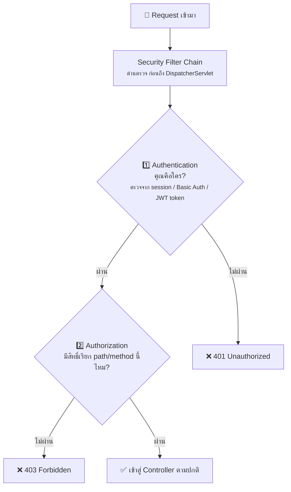

# บทที่ 8: Spring Security เบื้องต้น


เพิ่ม dependency แล้วทุก endpoint จะถูกล็อกทันที (ต้อง login ก่อนถึงเรียกได้):

```xml
<dependency>
    <groupId>org.springframework.boot</groupId>
    <artifactId>spring-boot-starter-security</artifactId>
</dependency>
```

## 2 คำศัพท์หลัก

- **Authentication (ยืนยันตัวตน)** — "คุณคือใคร?" → ตรวจ username/password หรือ token
- **Authorization (ตรวจสิทธิ์)** — "คุณทำสิ่งนี้ได้ไหม?" → ตรวจ role เช่น ADMIN, USER

## Annotation ที่ใช้บ่อย

| Annotation | ความหมาย |
|---|---|
| `@EnableWebSecurity` | เปิดใช้และปรับแต่ง Spring Security |
| `@EnableMethodSecurity` | เปิดให้ใช้ `@PreAuthorize` บน method ได้ |
| `@PreAuthorize("hasRole('ADMIN')")` | method นี้เรียกได้เฉพาะ ADMIN |
| `@AuthenticationPrincipal` | ดึงข้อมูล user ที่ login อยู่มาใช้ใน Controller |

## ตัวอย่างการตั้งค่า

```java
@Configuration
@EnableWebSecurity
@EnableMethodSecurity
public class SecurityConfig {

    @Bean
    public SecurityFilterChain filterChain(HttpSecurity http) throws Exception {
        http
            .authorizeHttpRequests(auth -> auth
                .requestMatchers("/api/public/**").permitAll()      // เปิดให้ทุกคน
                .requestMatchers("/api/admin/**").hasRole("ADMIN")  // เฉพาะ ADMIN
                .anyRequest().authenticated()                       // ที่เหลือต้อง login
            )
            .httpBasic(Customizer.withDefaults());  // ใช้ Basic Auth (สำหรับฝึก)
        return http.build();
    }

    @Bean
    public PasswordEncoder passwordEncoder() {
        return new BCryptPasswordEncoder();  // เข้ารหัส password ก่อนเก็บ (ห้ามเก็บ plain text!)
    }
}
```

## ล็อกสิทธิ์ระดับ method

```java
@Service
public class UserService {

    @PreAuthorize("hasRole('ADMIN')")   // เฉพาะ ADMIN เท่านั้น
    public void deleteUser(Long id) { ... }

    @PreAuthorize("#username == authentication.name")  // ทำได้เฉพาะข้อมูลตัวเอง
    public User updateProfile(String username, ProfileRequest req) { ... }
}
```

## Flow การทำงานของ Spring Security



> 💡 จำง่าย ๆ: **401 = ยังไม่ได้ login, 403 = login แล้วแต่ไม่มีสิทธิ์**

ในงานจริง REST API มักใช้ **JWT (JSON Web Token)**: login ครั้งเดียวได้ token
แล้วแนบ token ใน header `Authorization: Bearer <token>` ทุก request — ดูรายละเอียดต่อใน [บทที่ 12](12-real-world-essentials.md)


---

⬅️ [บทที่ 7: การเขียน Test](07-testing.md) | [🏠 สารบัญ](../README.md) | [บทที่ 9: เจาะลึก Bean](09-bean-deep-dive.md) ➡️
