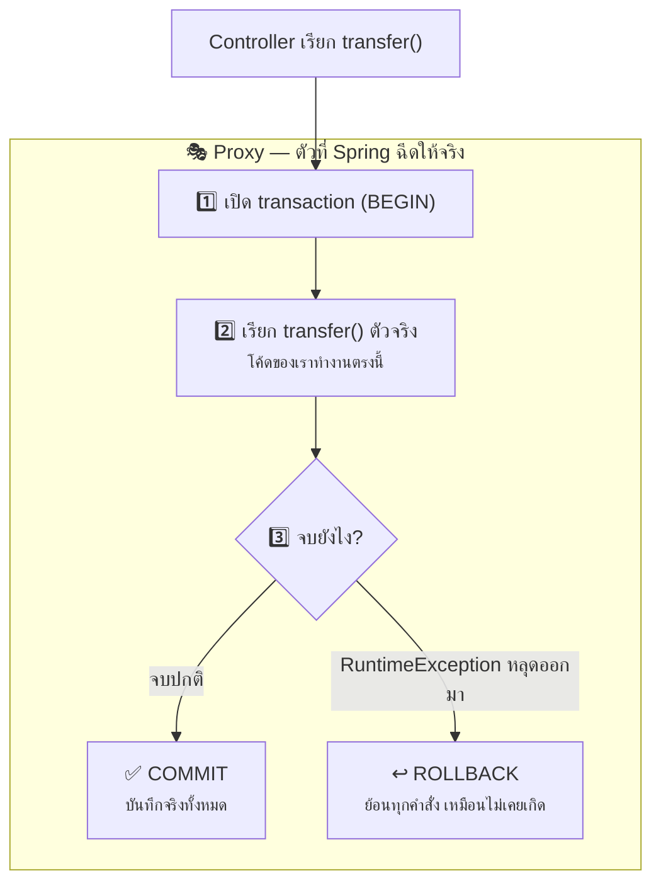
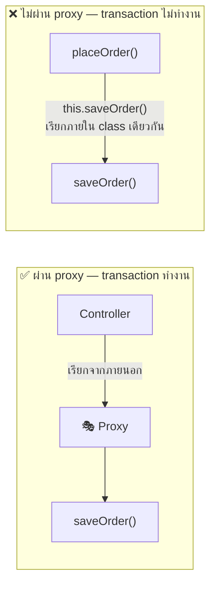

# บทที่ 9: เจาะลึก @Transactional — all-or-nothing กับฐานข้อมูล


## 1. Transaction คืออะไร?

Transaction = ชุดคำสั่ง database ที่ต้อง **"สำเร็จทั้งหมด หรือไม่ก็ไม่ทำเลยสักอย่าง"** (all-or-nothing)

ตัวอย่างคลาสสิก: **โอนเงิน** ต้องมี 2 คำสั่ง — หักเงินบัญชี A แล้วเพิ่มเงินบัญชี B

```java
public void transfer(Long fromId, Long toId, BigDecimal amount) {
    accountRepository.withdraw(fromId, amount);   // 1. หักเงิน A ✅ สำเร็จ
    accountRepository.deposit(toId, amount);      // 2. เพิ่มเงิน B 💥 พังตรงนี้!
}
```

- **ไม่มี transaction:** เงินถูกหักจาก A แล้ว แต่ B ไม่ได้รับ → เงินหายไปจากระบบ!
- **มี transaction:** ขั้นที่ 2 พัง → ขั้นที่ 1 ถูก **ย้อนกลับ (rollback)** อัตโนมัติ เหมือนไม่เคยเกิดขึ้น

## 2. @Transactional ทำอะไรให้เรา?

ติด annotation เดียว Spring ครอบ method ให้เป็น transaction อัตโนมัติ:

```java
@Service
public class TransferService {

    @Transactional
    public void transfer(Long fromId, Long toId, BigDecimal amount) {
        accountRepository.withdraw(fromId, amount);
        accountRepository.deposit(toId, amount);
        // จบ method ปกติ → commit (บันทึกจริงทั้งคู่)
        // มี RuntimeException หลุดออกมา → rollback (ย้อนทั้งคู่)
    }
}
```

## 3. ทำงานยังไงเบื้องหลัง? — ความลับคือ "Proxy"

เชื่อมกับเรื่อง Bean ใน [บทที่ 8](08-bean-deep-dive.md): Spring **ไม่ได้**ฉีด `TransferService` ตัวจริงให้ Controller
แต่ฉีด **ตัวห่อ (proxy)** ที่หน้าตาเหมือนกัน แต่แอบแทรกโค้ดเปิด/ปิด transaction ไว้หน้า-หลัง:



## 4. กับดักที่เจอบ่อยมาก (สำคัญ!)

**กับดัก 1: เรียก method ใน class เดียวกัน → @Transactional ไม่ทำงาน!**

```java
@Service
public class OrderService {

    public void placeOrder(Order order) {
        this.saveOrder(order);   // ❌ เรียกผ่าน this = ไม่ผ่าน proxy = ไม่มี transaction!
    }

    @Transactional
    public void saveOrder(Order order) { ... }
}
```

เพราะ proxy ครอบอยู่ "ข้างนอก" — การเรียกจากภายใน class เดียวกัน (`this.xxx()`) ไม่ผ่าน proxy
**ทางแก้:** ติด `@Transactional` ที่ method ทางเข้า (`placeOrder`) หรือแยก `saveOrder` ไปอยู่อีก Bean



**กับดัก 2: Checked exception ไม่ rollback โดย default**

Spring rollback เฉพาะ `RuntimeException` และ `Error` — ถ้าโยน checked exception (เช่น `IOException`) transaction จะ **commit ปกติ!**

```java
@Transactional(rollbackFor = Exception.class)   // rollback ทุก exception
public void importData(File file) throws IOException { ... }
```

**กับดัก 3: ต้องเป็น public method**

Proxy แทรกได้เฉพาะ method ที่ถูกเรียกจากภายนอก — ติดบน private method จะเงียบ ๆ ไม่ทำงาน

## 5. Option ที่ใช้บ่อย

| Option | ความหมาย | ใช้เมื่อ |
|---|---|---|
| `readOnly = true` | บอกว่าอ่านอย่างเดียว DB optimize ให้ | method ที่ query อย่างเดียว |
| `rollbackFor = Exception.class` | rollback ทุก exception รวม checked | มี checked exception ในงาน |
| `propagation = REQUIRES_NEW` | เปิด transaction ใหม่แยกต่างหาก พังก็ไม่ลากแม่ล้มตาม | เขียน audit log ที่ต้องบันทึกเสมอ |

```java
@Transactional(readOnly = true)
public List<Order> findAll() { ... }

@Transactional(propagation = Propagation.REQUIRES_NEW)
public void writeAuditLog(...) { ... }   // บันทึกเสมอ แม้งานหลัก rollback
```

## สรุปสั้น ๆ

> **@Transactional = ครอบ method ให้เป็น all-or-nothing ผ่านกลไก proxy**
> - จบปกติ → commit / เจอ `RuntimeException` → rollback (checked exception ต้องใส่ `rollbackFor` เอง)
> - ติดที่ **ชั้น Service** — ที่เดียวที่รู้ว่า "1 งาน" ประกอบด้วยกี่คำสั่ง (ไม่ติดที่ Controller ส่วน Repository นั้น Spring Data JPA จัดการเองอยู่แล้ว)
> - ระวัง: เรียกข้าม method ใน class เดียวกันไม่ผ่าน proxy → ไม่ทำงาน


---

⬅️ [บทที่ 8: เจาะลึก Bean](08-bean-deep-dive.md) | [🏠 สารบัญ](../README.md) | [บทที่ 10: จากโค้ดฝึกหัดสู่งานจริง](10-production-ready.md) ➡️
