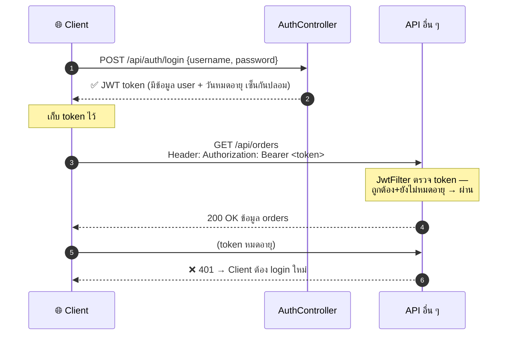

# บทที่ 12: สิ่งที่เจอบ่อยในงานจริง


## 1. Pagination — แบ่งหน้าข้อมูล

API ที่คืนข้อมูลเป็นพัน ๆ แถวในครั้งเดียว = ช้าและเปลืองทั้งสองฝั่ง
Spring Data ให้ `Pageable` + `Page<T>` มาฟรี ๆ:

```java
// Repository — แค่เปลี่ยน return type
public interface ProductRepository extends JpaRepository<Product, Long> {
    Page<Product> findByCategory(String category, Pageable pageable);
}

// Controller — Spring แปลง query string เป็น Pageable ให้เอง
@GetMapping
public Page<ProductResponse> list(
        @PageableDefault(size = 20, sort = "name") Pageable pageable) {
    return productService.findAll(pageable).map(ProductResponse::from);
}
```

```
GET /api/products?page=0&size=20&sort=price,desc
                    │       │        │
                 หน้าแรก  20 แถว   เรียงราคามาก→น้อย
```

ผลลัพธ์ `Page<T>` มี metadata ให้ครบ: `totalElements`, `totalPages`, `number` (หน้าปัจจุบัน) — frontend ใช้ทำปุ่มเปลี่ยนหน้าได้เลย

## 2. JWT Authentication — login แบบ token

Basic Auth ([บทที่ 8](08-security.md)) ส่ง username/password ทุก request — ใช้ฝึกได้แต่งานจริงใช้ **JWT**:
login ครั้งเดียว ได้ token แล้วแนบ token แทนรหัสผ่านในทุก request ถัดไป



หัวใจของ token: **server ไม่ต้องจำอะไรเลย** — ข้อมูล user อยู่ใน token และมีลายเซ็นกันปลอมแปลง server แค่ตรวจลายเซ็นก็รู้ว่าใครส่งมา

ส่วนประกอบที่ต้องเขียนเพิ่มจาก [บทที่ 8](08-security.md): `AuthController` (รับ login แจก token), `JwtService` (สร้าง/ตรวจ token — ใช้ library `jjwt`), และ `JwtAuthenticationFilter` (ดักทุก request ตรวจ header) — แนะนำหาบทความ "Spring Security JWT" ประกอบตอนลงมือทำ

## 3. Swagger / OpenAPI — เอกสาร API อัตโนมัติ

เพิ่ม dependency เดียว ได้หน้าเว็บเอกสาร API ที่กดลองยิงได้เลย:

```xml
<dependency>
    <groupId>org.springdoc</groupId>
    <artifactId>springdoc-openapi-starter-webmvc-ui</artifactId>
</dependency>
```

เปิด `http://localhost:8080/swagger-ui.html` → เห็นทุก endpoint พร้อมรูปแบบ request/response ที่ scan จาก Controller ให้อัตโนมัติ ทีม frontend เปิดดูเองได้ไม่ต้องถามเรา

แต่งเอกสารเพิ่มได้ด้วย annotation:

```java
@Operation(summary = "ดึงข้อมูลผู้ใช้ตาม id")
@ApiResponse(responseCode = "404", description = "ไม่พบผู้ใช้")
@GetMapping("/{id}")
public UserResponse getUser(@PathVariable Long id) { ... }
```

## 4. เรียก API ภายนอก — RestClient และ @HttpExchange

**วิธีที่ 1: RestClient** (ตัวมาตรฐานปัจจุบัน แทน RestTemplate เดิม):

```java
@Service
public class WeatherService {

    private final RestClient restClient = RestClient.builder()
            .baseUrl("https://api.weather.com")
            .build();

    public Weather getWeather(String city) {
        return restClient.get()
                .uri("/v1/current?city={city}", city)
                .retrieve()
                .body(Weather.class);
    }
}
```

**วิธีที่ 2: HTTP Interface** — ฟีเจอร์เด่นของ Spring Boot 4: ประกาศ interface แล้ว Spring implement ให้เอง (สไตล์เดียวกับที่ Repository ทำกับ database):

```java
@HttpExchange("/v1")
public interface WeatherApi {

    @GetExchange("/current")
    Weather getWeather(@RequestParam String city);   // ไม่ต้องเขียน body เลย!
}
```

```properties
# Spring Boot 4 ตั้งค่า client ให้ผ่าน properties ได้เลย
spring.http.client.service.weather.base-url=https://api.weather.com
```

## 5. Spring Boot Actuator — ตรวจสุขภาพแอป

```xml
<dependency>
    <groupId>org.springframework.boot</groupId>
    <artifactId>spring-boot-starter-actuator</artifactId>
</dependency>
```

ได้ endpoint สำเร็จรูปสำหรับ monitor:

| Endpoint | บอกอะไร |
|---|---|
| `/actuator/health` | แอป+database ยังดีอยู่ไหม — ระบบ deploy (เช่น Kubernetes) ใช้ตัวนี้เช็คก่อนส่ง traffic |
| `/actuator/metrics` | ตัวเลขต่าง ๆ: memory, CPU, จำนวน request |
| `/actuator/info` | เวอร์ชันแอป, uptime, timezone |

```properties
# เลือกเปิดเฉพาะที่จำเป็น (อย่าเปิดหมดใน prod — บาง endpoint เผยข้อมูลภายใน)
management.endpoints.web.exposure.include=health,info,metrics
```


---

⬅️ [บทที่ 11: จากโค้ดฝึกหัดสู่งานจริง](11-production-ready.md) | [🏠 สารบัญ](../README.md) | [บทที่ 13: Annotation เพิ่มพลัง](13-power-annotations.md) ➡️
