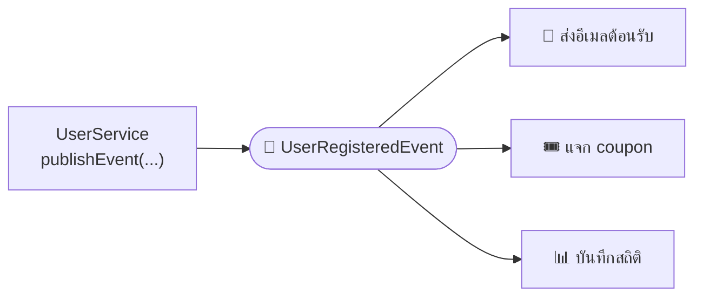

# บทที่ 13: Annotation เพิ่มพลัง — @Scheduled, @Async, @Cacheable, @EventListener


กลุ่มนี้เรียนง่ายสุด: แต่ละตัวเปิดความสามารถใหม่ให้ method ธรรมดา ๆ ทันที

## 1. @Scheduled — สั่งรันงานตามเวลา

```java
@SpringBootApplication
@EnableScheduling          // ← ต้องเปิดสวิตช์ที่ main class ก่อน
public class DemoApplication { ... }
```

```java
@Component
public class ReportJob {

    @Scheduled(cron = "0 0 0 * * *")        // ทุกเที่ยงคืน
    public void generateDailyReport() { ... }

    @Scheduled(fixedRate = 60_000)          // ทุก 60 วินาที (นับจากเริ่มรอบก่อน)
    public void checkPendingOrders() { ... }

    @Scheduled(fixedDelay = 30_000)         // เว้น 30 วิ หลังรอบก่อน "จบ"
    public void syncData() { ... }
}
```

> 💡 อ่าน cron: `วินาที นาที ชั่วโมง วัน เดือน วันในสัปดาห์` เช่น `0 30 9 * * MON-FRI` = 9:30 เช้าทุกวันทำงาน

## 2. @Async — ทำงานเบื้องหลัง ไม่ให้ user รอ

```java
@SpringBootApplication
@EnableAsync               // ← เปิดสวิตช์ก่อนเช่นกัน
public class DemoApplication { ... }
```

```java
@Service
public class NotificationService {

    @Async     // method นี้รันใน thread แยก — คนเรียกไม่ต้องรอ
    public void sendWelcomeEmail(String email) {
        // ส่งอีเมลใช้เวลา 3 วินาที แต่ user ได้ response ทันที ไม่ต้องรอ
    }
}
```

use case คลาสสิก: สมัครสมาชิกเสร็จ → ตอบ 200 ให้ user ทันที ส่วนอีเมลต้อนรับค่อย ๆ ส่งเบื้องหลัง

> ⚠️ `@Async` ทำงานผ่าน **proxy เหมือน @Transactional** ([บทที่ 10](10-transactional.md)) — เรียกจากใน class เดียวกัน (`this.xxx()`) จะไม่ async!

## 3. @Cacheable / @CacheEvict — จำผลลัพธ์ ไม่ query ซ้ำ

```java
@SpringBootApplication
@EnableCaching             // ← เปิดสวิตช์
public class DemoApplication { ... }
```

```java
@Service
public class ProductService {

    @Cacheable("products")           // ครั้งแรก query จริง + จำผลไว้ / ครั้งถัดไปตอบจาก cache ทันที
    public Product findById(Long id) {
        return productRepository.findById(id).orElseThrow();
    }

    @CacheEvict(value = "products", key = "#product.id")   // ข้อมูลเปลี่ยน → ลบ cache ตัวนั้นทิ้ง
    public Product update(Product product) {
        return productRepository.save(product);
    }
}
```

เหมาะกับข้อมูลที่ **อ่านบ่อยแต่เปลี่ยนไม่บ่อย** เช่น รายการหมวดหมู่สินค้า, ค่า config
(default เก็บใน memory — งานจริงมักต่อกับ Redis ซึ่งแค่เพิ่ม starter ก็สลับให้เอง)

## 4. @EventListener — แยก logic ออกจากกันด้วย event

ปัญหา: สมัครสมาชิกเสร็จต้อง ส่งอีเมล + แจก coupon + บันทึกสถิติ — ถ้าเขียนทั้งหมดใน `UserService` มันจะบวมและผูกติดกันหมด

ทางแก้: `UserService` แค่ **ประกาศ event** แล้วใครสนใจก็มาฟังเอง:

```java
// 1. ตัว event — record ธรรมดา
public record UserRegisteredEvent(Long userId, String email) {}

// 2. คนประกาศ — จบงานตัวเองแล้วตะโกนบอก ไม่รู้จักคนฟังเลย
@Service
@RequiredArgsConstructor
public class UserService {
    private final ApplicationEventPublisher events;

    public User register(RegisterRequest req) {
        User user = userRepository.save(...);
        events.publishEvent(new UserRegisteredEvent(user.getId(), user.getEmail()));
        return user;
    }
}

// 3. คนฟัง — อยู่คนละ class แยกขาดจากกัน เพิ่ม/ลบได้โดยไม่แตะ UserService
@Component
public class WelcomeEmailListener {

    @Async                                        // ผสมกับ @Async ได้ — ฟังแบบเบื้องหลัง
    @EventListener
    public void on(UserRegisteredEvent event) {
        emailService.sendWelcome(event.email());
    }
}
```



## สรุปกลุ่มนี้

| Annotation | เปิดสวิตช์ด้วย | ใช้ทำอะไร |
|---|---|---|
| `@Scheduled` | `@EnableScheduling` | รันงานตามเวลา (cron, ทุก X วินาที) |
| `@Async` | `@EnableAsync` | ทำงานเบื้องหลัง ไม่ block |
| `@Cacheable` / `@CacheEvict` | `@EnableCaching` | จำผลลัพธ์ / ลบเมื่อข้อมูลเปลี่ยน |
| `@EventListener` | — (ใช้ได้เลย) | ฟัง event แยก logic ออกจากกัน |

> 📌 สังเกต: `@Scheduled`, `@Async`, `@Cacheable` ทั้งหมดทำงานผ่าน **proxy** แบบเดียวกับ `@Transactional` — กับดัก self-invocation ([บทที่ 10](10-transactional.md)) ใช้กับพวกนี้ด้วยทุกตัว


---

⬅️ [บทที่ 12: สิ่งที่เจอบ่อยในงานจริง](12-real-world-essentials.md) | [🏠 สารบัญ](../README.md) | [Cheat Sheet](cheat-sheet.md) ➡️
